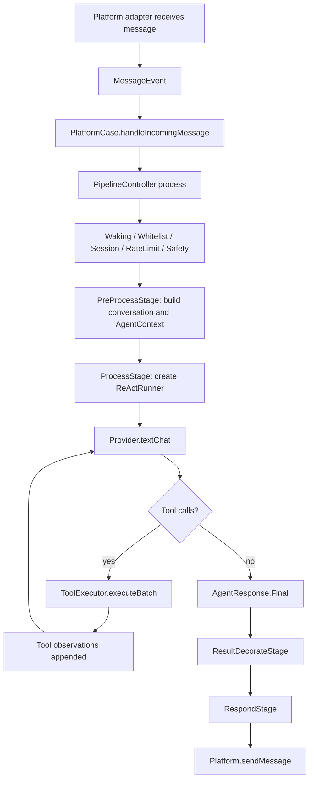

# AstrBot.kt Module Status

梳理时间：2026-06-24；v3 首批能力状态更新至 2026-06-25

本文基于当前仓库代码梳理 AstrBot.kt/PriestessBot 的模块现状、已实现能力和主要接口。代码根包为 `com.heyanle.priestess.bot`。

> 注：本文记录的是 2026-06-24 这次梳理时的主干代码状态，并已同步 2026-06-25 v3 首批 OpenSpec change 的落地结果。仍未进入默认运行路径的能力会在各模块边界中单独标注。

## 总览

当前工程已经形成一条可运行的聊天 Agent 闭环：

整体分层：

- Runtime/DI 负责对象装配、启动和协调关闭。
- Config 负责本地配置、环境变量覆盖、备份恢复和文件 watch reload。
- Platform 负责 IM 平台抽象、消息收发和平台实例管理。
- Pipeline 负责消息处理阶段编排。
- Agent Loop 负责 ReAct 推理、上下文压缩、tool 调用和 hooks。
- Provider 负责 LLM 接入。
- Tool/MCP 负责函数工具、内置工具、策略检查和 MCP 工具桥接。
- Conversation/Knowledge/Memory/Reminder 负责会话历史、关键词知识检索、长期记忆和提醒事项。
- Plugin/Skill 负责扩展机制。
- Workspace 负责工作区配置、快照、解析和 reload 状态。
- Dashboard API/Frontend 负责运维、配置、测试和可观测入口。

## 模块速查

| 模块 | 已实现能力摘要 | 主要入口/接口 |
| --- | --- | --- |
| Core Runtime | Koin 装配、Dashboard server 启动、协调关闭、SQLite/Exposed 基础表 | `PriestessRuntime`、`coreModule`、`DatabaseController`、`AppDatabase` |
| Config | 配置读写/替换/reload、备份恢复、环境变量覆盖、StateFlow 分发 | `PriestessConfig`、`ConfigController`、`ConfigCase` |
| Platform | 统一消息/会话模型、Telegram/NapCat 适配、平台 registry、运行实例同步 | `Platform`、`MessageEvent`、`PlatformController`、`PlatformRegistry` |
| Pipeline | 9 阶段消息处理链、onion flow、协程 job、drain、指标 | `PipelineController`、`Stage`、`PipelineContext` |
| Agent Loop | ReAct 循环、上下文压缩、tool observation 注入、hooks、agent 级 tool timeout | `AgentRunner`、`ReActRunner`、`AgentContext`、`ContextManager` |
| Sub-agent | 规则路由、默认 fallback、子 Agent 执行与 Dashboard 测试 | `SubAgentOrchestrator`、`SubAgentConfig` |
| Provider | OpenAI/Ollama/Anthropic/Gemini 接入、Provider registry、测试和模型列表 | `ChatProvider`、`ProviderController`、`ProviderRegistry` |
| Tool/MCP | Tool schema/policy/executor、内置工具、MCP stdio/SSE/HTTP transport | `FunctionTool`、`ToolSchema`、`ToolExecutor`、`ToolPolicy`、`McpClient` |
| Conversation | 会话 CRUD、消息历史持久化、历史搜索、Dashboard 查询 | `ConversationController`、`MessageHistory`、`ConversationCase` |
| Knowledge | 知识库、chunk 持久化、关键词检索、Agent tool | `KnowledgeController`、`KnowledgeCase`、`KnowledgeSearchTool` |
| Memory | workspace/scope 维度长期记忆、关键词召回、TTL、软删除、Agent tools | `MemoryController`、`MemoryCase`、`MemoryRecord`、`Memory*Tool` |
| Reminder | workspace/session/user 维度提醒、到期投递、软删除、Agent tools | `ReminderController`、`ReminderCase`、`ReminderRecord`、`Reminder*Tool` |
| Plugin | manifest、发现、生命周期、隔离 ClassLoader、Tool/Provider/Platform 贡献 | `PluginController`、`PluginContext`、`PluginRuntime` |
| Skill | 轻量 skill 注册、优先级排序、dispatch、workspace skill prompt document 暴露 | `Skill`、`SkillController`、`SkillCase`、`PipelineSkillState` |
| Workspace | 配置源、校验、快照发布、解析规则、reload plan/status | `WorkspaceConfig`、`WorkspaceController`、`WorkspaceSnapshot` |
| Dashboard | Ktor API、静态前端、日志 WS、健康检查、Prometheus 指标 | `PriestessBotServer`、`DashboardRoutes`、`DashboardService` |
| Observability | 内存指标 registry、近期日志缓存和推送 | `MetricsRegistry`、`DashboardLogHub` |

## Core Runtime

主要文件：

- `PriestessBot.kt`
- `PriestessRuntime.kt`
- `core/di/CoreModule.kt`
- `core/controller/BaseController.kt`
- `core/db/*`

已实现能力：

- `PriestessBot.main` 启动 Koin，解析 `PriestessRuntime` 并启动 server。
- Runtime 停止时按顺序关闭 platforms、pipeline、server、plugins、providers、tools、workspace、database、config。
- Pipeline 关闭前执行 drain，等待处理中消息完成。
- SQLite/Exposed 数据库连接在 `DatabaseController` 构造时建立。
- 当前数据库表覆盖 conversations、messages、knowledge_bases、knowledge_chunks、memory_records、reminder_records。

相关接口：

- `PriestessRuntime.start()`
- `PriestessRuntime.stop()`
- `BaseController.launchTask(...)`
- `DatabaseController.open()`
- `DatabaseController.close()`
- `DatabaseController.execute(...)`
- `DatabaseCase`
- `AppDatabase`
- `coreModule`

现状与边界：

- Runtime 当前直接启动 Dashboard server；平台实例由 `PlatformController` 根据配置流同步。
- 停止流程具备容错，单个模块 stop 失败不会阻断后续关闭。
- memory/reminder 表结构已经进入主干 schema；workspace 当前是配置与内存快照模型，尚未持久化为独立数据库表。

## Config

主要文件：

- `config/PriestessConfig.kt`
- `config/ConfigController.kt`
- `config/ConfigCase.kt`
- `config/*Config.kt`

已实现能力：

- `PriestessConfig` 聚合 platform、provider、agent、database、pipeline、server、plugin、sub-agent 配置。
- 支持配置读取、写入、替换、reload、文件 watch。
- 支持配置备份列表与按 id 恢复。
- 支持环境变量覆盖 server、database、plugin 等关键运行配置。
- 每个配置域通过 `StateFlow` 向下游 controller 分发。
- Dashboard API 可读取、替换、reload、恢复配置。

相关接口：

- `PriestessConfig`
- `ConfigController.current()`
- `ConfigController.replace(...)`
- `ConfigController.update(...)`
- `ConfigController.reload()`
- `ConfigController.save(...)`
- `ConfigController.startFileWatcher(...)`
- `ConfigController.listBackups()`
- `ConfigController.restoreBackup(...)`
- `ConfigCase.current()`

现状与边界：

- 配置模型均为 `@Serializable` data class，适合作为 API DTO 和本地配置文件结构。
- `ServerConfig` 已包含 `apiToken`、CORS、配置 watch 开关与轮询间隔。
- workspace 级 skill/MCP 配置已可通过 `WorkspaceController.reload(...)` 构建候选 snapshot 后原子发布；全局配置文件 watch reload 只更新配置源，workspace snapshot 仍由显式 workspace reload 发布。

## Platform

主要文件：

- `platform/Platform.kt`
- `platform/PlatformRegistry.kt`
- `platform/PlatformController.kt`
- `platform/PlatformCase.kt`
- `platform/adapters/telegram/TelegramPlatform.kt`
- `platform/adapters/napcat4_18_6/NapCatPlatform.kt`

已实现能力：

- 统一消息模型：文本、图片、At、文件。
- 统一会话模型：私聊、群、频道。
- 平台抽象支持启动、停止、发送消息、设置消息处理器、可选 webhook。
- 平台 registry 支持内建和插件注册平台。
- 已有 Telegram 与 NapCat 适配器。
- `PlatformController` 订阅 platform 配置流，按 enabled 配置创建和停止平台实例。
- Dashboard API 支持平台列表、启用、停用。

相关接口：

- `Platform`
- `Platform.run(): Job`
- `Platform.terminate()`
- `Platform.sendMessage(session, chain)`
- `Platform.setMessageHandler(...)`
- `Platform.webhookCallback(...)`
- `PlatformCase.handleIncomingMessage(event)`
- `MessageEvent`
- `MessageChain`
- `MessageSession`
- `PlatformMetadata`
- `PlatformRegistry.registerMeta(...)`
- `PlatformRegistry.createFromConfig(...)`
- `PlatformController.getRunning()`

现状与边界：

- 平台适配器通过 `commitEvent(event)` 将消息交给 pipeline。
- `SendMessageTool` 与 `EarlyReplyTool` 复用 `AgentToolContext.platform/session` 完成主动发送。
- Dashboard 的 start/stop 本质是修改 enabled 配置；实际启停由配置流同步。
- 插件注册 platform factory 已存在，但平台热替换、冲突策略和集成测试仍可继续补强。

## Pipeline

主要文件：

- `pipeline/PipelineController.kt`
- `pipeline/PipelineContext.kt`
- `pipeline/Stage.kt`
- `pipeline/stages/*`

已实现能力：

- 固定 9 阶段处理链：`WakingCheck`、`WhitelistCheck`、`SessionStatus`、`RateLimit`、`ContentSafety`、`PreProcess`、`Process`、`ResultDecorate`、`Respond`。
- 支持 onion model：stage 返回 `Flow<Unit>` 时，下游阶段执行后再收集后置逻辑。
- 每条平台消息独立 coroutine job。
- 支持 shutdown drain 和超时取消。
- Pipeline 指标：消息计数与耗时。
- `PreProcessStage` 创建/恢复会话上下文，并可路由子 Agent。
- `ProcessStage` 每条消息创建新的 `ReActRunner` 执行 Agent 循环。
- `RespondStage` 将最终结果或错误文本发回平台。

相关接口：

- `Stage`
- `StageOrder`
- `PipelineContext`
- `PipelineController.process(event)`
- `PipelineController.drain(timeoutMillis)`
- `PipelineCase.process(event)`

现状与边界：

- 阶段顺序在 `PipelineController.buildStages(...)` 内固定，不由插件或 DI 外部动态注册。
- `buildStages(...)` 每次读取 `ConfigCase.current()` 构造阶段，因此配置替换后新消息会使用新配置。
- 阶段异常会记录日志并中断该阶段下游流程，不向终端用户暴露详细异常。

## Agent Loop

主要文件：

- `agent/Agent.kt`
- `agent/AgentCase.kt`
- `agent/AgentContext.kt`
- `agent/AgentRunner.kt`
- `agent/runner/ReActRunner.kt`
- `agent/context/*`
- `agent/AgentHooks.kt`
- `agent/AgentResponse.kt`

已实现能力：

- Agent 配置包含名称、系统提示词、providerName、model、最大步数、工具超时、上下文压缩策略。
- ReAct 循环：上下文压缩 -> LLM 请求 -> tool call -> tool observation -> 下一轮 -> final。
- 支持多个 tool call 顺序执行。
- 支持 Agent hooks：begin、tool start、tool end、done、error。
- 支持上下文压缩策略：`ROUND_TRUNCATION`、`TOKEN_WINDOW`、`LLM_COMPRESS`。
- 支持压缩失败 fallback。
- `Agent.toolTimeoutMs` 已由 `ReActRunner` 传入 `ToolExecutor.executeBatch(...)`。
- LLM system prompt 按上下文块拼装：`Platform`、`Role Document`、`Tools`、`Loaded Skills`。
- `use_skill` 工具执行后会刷新后续 LLM 请求中的 system prompt，使已装载 skill 文档进入 `Loaded Skills` 块。
- LLM 请求会使用消息快照，避免后续 system prompt 刷新影响已发出的 provider request。
- `AgentResponse` 区分 Thinking、ToolExecuted、Final、Error。

相关接口：

- `Agent`
- `AgentCase.createAgent(...)`
- `AgentContext`
- `AgentContext.skillState`
- `AgentRunner.step()`
- `AgentRunner.stepUntilDone()`
- `ReActRunner`
- `ContextManager.compress(...)`
- `ContextCompressStrategy.compress(...)`
- `AgentHooks`
- `AgentResponse`

现状与边界：

- `ReActRunner` 使用 `Mutex` 串行化 step/reset，避免单 runner 并发状态错乱。
- `stepUntilDone()` 开始时插入 system message 并触发 hooks。
- 达到 `agent.maxSteps` 仍无 final 时返回 `AgentResponse.Error`。
- 当前 tool call batch 是顺序执行，不是并行执行。

## Sub-agent Orchestration

主要文件：

- `agent/orchestration/SubAgentOrchestrator.kt`
- `config/SubAgentConfig.kt`

已实现能力：

- 支持子 Agent 编排配置。
- 支持 deterministic keyword route selection。
- 支持默认子 Agent fallback。
- 支持通过现有 ReAct runtime 执行选中的子 Agent。
- Dashboard API 支持读取/替换子 Agent 配置与测试路由执行。

相关接口：

- `SubAgentOrchestrator.run(...)`
- `SubAgentSelection`
- `SubAgentRunResult`
- `SubAgentOrchestrationConfig`
- `SubAgentConfig`
- `SubAgentRouteConfig`

现状与边界：

- 子 Agent 测试会收集 Agent events，返回选中 agent、route、状态、内容和 conversation id。
- Pipeline 可在 `PreProcessStage` 中选择子 Agent，后续仍走普通 ReAct 执行。
- 多角色协作目前是规则路由和单次委派形态，尚不是完整多 agent 并行协作系统。

## Provider

主要文件：

- `provider/Provider.kt`
- `provider/ProviderController.kt`
- `provider/ProviderCase.kt`
- `provider/BuiltinProviders.kt`
- `provider/adapters/*`
- `provider/model/*`

已实现能力：

- 统一 `ChatProvider` 接口。
- Provider metadata 描述模型类型、工具调用、视觉、流式支持。
- Provider registry 支持内建和插件注册 Provider。
- 已有 Provider 类型：OpenAI/OpenAI-compatible、Ollama、Anthropic、Gemini。
- 支持 provider 测试、模型列表获取、Dashboard 列表展示。
- LLM 请求/响应模型包含 messages、tools、tool calls、token usage。

相关接口：

- `Provider`
- `ChatProvider.textChat(request)`
- `ChatProvider.getModels()`
- `ChatProvider.test()`
- `ProviderMetadata`
- `ProviderRegistry`
- `ProviderController.register(...)`
- `ProviderController.unregister(...)`
- `ProviderCase.getByName(...)`
- `LLMRequest`
- `LLMResponse`
- `ConversationMessage`
- `ToolCall`

现状与边界：

- `ProcessStage` 优先按 agent 的 provider/model 配置选择 provider；找不到时 fallback 到第一个可用 provider。
- ProviderController 支持 runtime 注册/反注册，插件贡献 provider 时会覆盖同名 provider。
- 流式响应 metadata 已有表达，但主 pipeline 仍以非流式 final 响应为主。

## Tool and MCP

主要文件：

- `tool/FunctionTool.kt`
- `tool/ToolSchema.kt`
- `tool/ToolSet.kt`
- `tool/ToolController.kt`
- `tool/ToolExecutor.kt`
- `tool/ToolPolicy.kt`
- `tool/ToolListing.kt`
- `tool/builtin/*`
- `tool/mcp/*`

已实现能力：

- 统一函数工具抽象：schema + execute。
- Tool schema 可转换为 OpenAI 与 Anthropic tool 格式。
- Tool schema 已携带风险等级、能力依赖、默认启用、审计标记等元数据。
- ToolExecutor 支持按名称解析、JSON 参数解析、必填参数校验、policy 检查、timeout、执行、错误封装、指标记录。
- ToolPolicy 支持 allow-all 与配置化策略，能表达启用/禁用、风险等级、能力缺失、高风险确认、审计决策。
- ToolResult 已包含结构化错误码、policy denial code、missing capabilities。
- ToolController 管理注册工具，支持覆盖同名工具。
- ToolListing 提供面向 Dashboard/list_tools 的 source、owner、risk、capability、enabled、statusReason 视图。
- MCP client 支持 stdio、SSE、Streamable HTTP transport。
- MCP tool 可以包装为本地 `FunctionTool`。

内建工具：

| Tool | 状态 | 说明 |
| --- | --- | --- |
| `list_tools` | 已实现 | 列出已注册工具，可按 source/risk/query 过滤。 |
| `health_check` | 已实现 | 返回运行时健康状态、组件状态和诊断信息。 |
| `fetch_url` | 已实现 | 拉取 URL 内容，默认禁用，依赖 network capability。 |
| `conversation_search` | 已实现 | 搜索会话历史，依赖 conversation_history capability。 |
| `system_info` | 已实现 | 返回 agent、model、平台、会话、工具列表和 JVM 运行时信息。 |
| `early_reply` | 已实现 | 在长任务中提前向当前会话发送消息。 |
| `send_message` | 已实现 | 向当前或指定 session 发送消息，默认禁用并审计。 |
| `web_search` | 占位/降级 | schema 与策略已在，当前未接真实搜索 provider。 |
| `knowledge_search` | 已实现 | 调用本地知识库关键词检索。 |
| `memory_save` | 已实现 | 保存 workspace 与 scope 绑定的长期记忆，默认禁用并审计。 |
| `memory_recall` | 已实现 | 召回当前上下文可见的长期记忆。 |
| `memory_delete` | 已实现 | 按 memory id 软删除当前上下文可见的记忆，默认禁用并审计。 |
| `create_reminder` | 已实现 | 创建 workspace/session/user 维度提醒，默认禁用并审计。 |
| `list_reminders` | 已实现 | 查询当前上下文可见的提醒。 |
| `delete_reminder` | 已实现 | 按 reminder id 软删除当前上下文可见的提醒，默认禁用并审计。 |

相关接口：

- `FunctionTool`
- `ToolSchema`
- `ToolRiskLevel`
- `ToolCapabilities`
- `ToolPolicy`
- `ToolPolicyConfig`
- `ToolPolicyDecision`
- `ToolPolicyDenialCode`
- `ToolSet.toOpenAIFormat()`
- `ToolController.register(...)`
- `ToolController.unregister(name)`
- `ToolController.getRegisteredTools()`
- `ToolExecutor.execute(...)`
- `ToolExecutor.executeBatch(...)`
- `ToolListing.list(...)`
- `AgentToolContext`
- `McpClient`
- `McpTransport`
- `McpTool`
- `McpConfig`

现状与边界：

- ToolExecutor 当前顺序执行 batch tool calls。
- 参数解析结果统一转为 `Map<String, String>`，复杂 JSON 参数会以字符串形式传入工具。
- policy 能力主要在 `ToolExecutor` 内生效，尚未完整接入 workspace/agent 配置面板与持久审计日志。
- memory/reminder 工具已经进入主干；若运行时依赖缺失，`BuiltinTools` 会以 placeholder/statusReason 形式暴露降级状态。
- MCP transport/client 基础结构已接入 workspace resolver；workspace reload 会初始化候选 MCP clients/tools，失败保留旧 snapshot 并关闭失败候选 handles，旧 snapshot handles 按 pipeline lease 延迟释放。

## Conversation

主要文件：

- `conversation/Conversation.kt`
- `conversation/ConversationController.kt`
- `conversation/ConversationCase.kt`
- `conversation/MessageHistory.kt`

已实现能力：

- 会话 CRUD。
- 会话过期清理。
- 消息历史持久化。
- 为 Agent 上下文提供历史消息。
- 支持按 conversation、role、query、limit 搜索消息历史。
- Dashboard API 支持会话列表与按 conversation id 查询消息详情。
- `conversation_search` tool 复用 `ConversationCase.searchMessages(...)`。

相关接口：

- `Conversation`
- `ConversationController.create(...)`
- `ConversationController.getOrCreate(...)`
- `ConversationController.cleanupExpired(...)`
- `ConversationCase`
- `MessageHistory.store(...)`
- `MessageHistory.getRecentMessages(...)`
- `MessageHistory.search(...)`
- `StoredMessage`
- `ConversationMessageSearchQuery`
- `ConversationSearchResult`

现状与边界：

- 历史消息使用统一的 `ConversationMessage` 结构，与 Provider request 兼容。
- Dashboard conversation detail 支持通过 `count` 查询最近消息。
- 长期记忆已由 `MemoryController`/`MemoryCase` 管理，并通过 `PersonaMemoryInjector` 在 `PreProcessStage` 注入 Agent instructions；会话历史仍作为短期上下文保留。

## Knowledge RAG

主要文件：

- `knowledge/KnowledgeModels.kt`
- `knowledge/KnowledgeController.kt`
- `knowledge/KnowledgeCase.kt`
- `knowledge/KeywordKnowledgeRetriever.kt`
- `tool/builtin/KnowledgeSearchTool.kt`

已实现能力：

- 知识库创建与列表。
- 文本文档按段落/长度切分 chunk。
- chunk 持久化。
- 关键词检索。
- Dashboard API 支持创建 base、添加文档、搜索。
- Agent 可通过 `knowledge_search` 工具调用知识检索。

相关接口：

- `KnowledgeBase`
- `KnowledgeChunk`
- `KnowledgeSearchResult`
- `KnowledgeController`
- `KnowledgeCase.createBase(...)`
- `KnowledgeCase.listBases()`
- `KnowledgeCase.addTextDocument(...)`
- `KnowledgeCase.search(...)`
- `KeywordKnowledgeRetriever`
- `KnowledgeSearchTool`

现状与边界：

- 当前检索是 keyword-based，不是 embedding/vector RAG。
- `KnowledgeCase.search` 的 limit 被限制在 1 到 20。
- 保留 `KnowledgeCase.search(...)` 作为未来向 embedding/vector 迁移的稳定入口比较合适。

## Memory

主要文件：

- `memory/MemoryModels.kt`
- `memory/MemoryController.kt`
- `memory/MemoryCase.kt`
- `tool/builtin/MemoryTools.kt`
- `core/db/DatabaseController.kt`

已实现能力：

- 长期记忆记录持久化到 `memory_records`。
- 支持 workspace 隔离。
- 支持 `GLOBAL`、`PLATFORM`、`SESSION`、`USER`、`AGENT` scope。
- 支持 `FACT`、`PREFERENCE`、`EVENT`、`SUMMARY` memory type。
- 保存时校验 scope 所需上下文，例如 SESSION memory 需要 session id。
- 支持 tags、confidence、expiresAt/TTL。
- 支持按上下文可见性 list/search/delete。
- 支持关键词与 tag 召回，并按 score/updatedAt 排序。
- 支持过期记忆软删除。
- Agent tools：`memory_save`、`memory_recall`、`memory_delete`。

相关接口：

- `MemoryRecord`
- `MemoryScope`
- `MemoryType`
- `MemoryScopeContext`
- `MemoryFilter`
- `MemorySearchQuery`
- `MemorySearchResult`
- `MemoryController.save(...)`
- `MemoryController.list(...)`
- `MemoryController.search(...)`
- `MemoryController.delete(...)`
- `MemoryController.expire(...)`
- `MemoryCase`
- `MemorySaveTool`
- `MemoryRecallTool`
- `MemoryDeleteTool`

现状与边界：

- 当前检索是轻量关键词/token 匹配，不是 embedding 语义检索。
- `memory_save` 和 `memory_delete` 默认关闭且需要审计；`memory_recall` 默认开启。
- 工具上下文通过 `AgentToolContext.metadata`、platform、session 和 agentName 推导 workspace/platform/session/user/agent scope。
- persona 已通过 `PersonaController`/`PersonaCase` 解析，并由 `PersonaMemoryInjector` 与 memory 一起进入 Agent runtime；自动记忆抽取尚未作为后台策略实现，当前依赖显式 memory tools/API 写入。

## Reminder

主要文件：

- `reminder/ReminderModels.kt`
- `reminder/ReminderController.kt`
- `reminder/ReminderCase.kt`
- `reminder/ReminderTimeParser.kt`
- `tool/builtin/ReminderTools.kt`
- `core/db/DatabaseController.kt`

已实现能力：

- 提醒记录持久化到 `reminder_records`。
- 支持 workspace、platform、session、sessionType、user 绑定。
- 支持 `PENDING`、`DELIVERED`、`FAILED`、`DELETED` 状态。
- 支持创建、查询、软删除。
- 支持绝对/相对时间解析和 timezone 参数。
- 支持到期提醒投递到绑定平台会话。
- 投递时有重复发送保护：只更新仍处于 PENDING 的记录。
- Agent tools：`create_reminder`、`list_reminders`、`delete_reminder`。

相关接口：

- `ReminderRecord`
- `ReminderStatus`
- `ReminderScopeContext`
- `ReminderFilter`
- `ReminderDeliveryResult`
- `ReminderController.create(...)`
- `ReminderController.list(...)`
- `ReminderController.delete(...)`
- `ReminderController.deliverDue(...)`
- `ReminderCase`
- `ReminderTimeParser.parse(...)`
- `CreateReminderTool`
- `ListRemindersTool`
- `DeleteReminderTool`

现状与边界：

- `create_reminder` 和 `delete_reminder` 默认关闭且需要审计；`list_reminders` 默认开启。
- 到期投递能力在 controller 内已具备，但全局调度器/后台 tick 与 Dashboard 管理页尚未完整落地。
- 当前提醒以一次性投递为主，尚未支持周期性 reminder。

## Plugin Runtime

主要文件：

- `plugin/Plugin.kt`
- `plugin/PluginController.kt`
- `plugin/PluginRuntime.kt`
- `plugin/PluginExtensionRegistry.kt`
- `plugin/PluginModels.kt`
- `plugin/PluginCase.kt`

已实现能力：

- 插件 manifest 模型。
- 插件发现：目录插件和 jar 插件。
- 插件生命周期：load、enable、disable、unload、reload。
- 插件隔离 ClassLoader。
- 插件失败隔离。
- 插件可注册 extension metadata。
- 插件可贡献 Tool、Provider、Platform。
- 插件禁用/卸载时清理当前 runtime contributions。
- Dashboard API 支持插件 discover、list、load、unload、enable、disable。

相关接口：

- `Plugin`
- `PluginContext`
- `DefaultPluginContext`
- `PluginController.discover()`
- `PluginController.load(id)`
- `PluginController.enable(id)`
- `PluginController.disable(id)`
- `PluginController.unload(id)`
- `PluginRuntime`
- `PluginExtensionRegistry`
- `PluginCase`
- `PluginManifest`
- `PluginDescriptor`
- `PluginExtensionMetadata`

现状与边界：

- `DefaultPluginContext.registerTool(...)` 会覆盖同名工具并记录归属。
- `registerProvider(...)` 会覆盖同名 ProviderController 条目。
- `registerPlatform(...)` 通过 `PlatformRegistry` 注册平台 factory。
- `PluginController.clearRuntimeContributions(id)` 当前只清 extension registry；已加载 runtime 的 disable/unload 会通过 context 清理 tool/provider/platform。

## Skill

主要文件：

- `skill/Skill.kt`
- `skill/DefaultSkill.kt`
- `skill/SkillController.kt`
- `skill/SkillCase.kt`

已实现能力：

- Skill 抽象与默认实现。
- SkillController 管理技能集合。
- 支持按 priority 排序。
- 支持 dispatch 到第一个可处理消息的 skill。
- 支持将 workspace-scoped skill 渲染为可装载的 prompt document。
- `Skill.skillMarkdown` 可承载真实 `SKILL.md` 原文；未提供时才退回到 name/description/priority/settings 的兼容渲染。
- Agent loop 暴露 `use_skill`/`unload_skill`，由 LLM 显式装载当前 Pipeline 可见 skill；后续 LLM 轮次会在 `Loaded Skills` 块看到已装载的 `SKILL.md` 内容。
- 支持注册、批量注册、注销、清空、查询。

相关接口：

- `Skill`
- `Skill.canHandle(message)`
- `Skill.execute(message)`
- `DefaultSkill`
- `SkillController.register(...)`
- `SkillController.registerAll(...)`
- `SkillController.dispatch(...)`
- `SkillCase`
- `PipelineSkillState`

现状与边界：

- 当前 skill 模块是轻量基础设施，尚未像 plugin/tool/provider 一样形成复杂运行时贡献链。
- workspace skill 配置已进入 snapshot，`SkillCase` 可按 pinned snapshot 提供 workspace-scoped skill documents；当前不做 skill 前置匹配，是否装载由 LLM 通过 `use_skill` 决定。更复杂的 skill 生命周期隔离和动态贡献链仍可后续增强。

## Workspace Runtime

主要文件：

- `workspace/WorkspaceModels.kt`
- `workspace/WorkspaceConfigSource.kt`
- `workspace/WorkspaceController.kt`
- `config/PriestessConfig.kt`
- `core/di/CoreModule.kt`

已实现能力：

- `PriestessConfig` 已包含 `workspaces` 配置入口。
- 当未显式配置 workspace 时，可从全局 agent、subAgents、agent.enabledTools 派生默认 workspace。
- `WorkspaceConfig` 覆盖 agents、providerName、skills、MCP servers、tools、personas、memory policy、subAgents、resolution rules。
- `WorkspaceController` 启动时加载并发布 workspace snapshots。
- 支持 list/get/resolve/reload/reloadAll。
- 支持 workspace 配置校验：重复 id、空 id/name、重复 skill、未知 skill/tool、重复 MCP id、stdio MCP command 缺失。
- 支持根据 metadata、platform、session、user、默认 workspace、首个 enabled workspace 解析工作区。
- 支持 reload plan，展示资源 added/removed/modified。
- 支持失败 reload 不覆盖旧 snapshot。
- snapshot 当前会解析 agent configs、providerName、toolNames、skillNames、mcpServerIds、personaIds、memoryPolicy、workspace tool policy、MCP runtime tools 与 closeable handles。
- reload diagnostics 不暴露 MCP env secret value。

相关接口：

- `WorkspaceConfig`
- `WorkspaceSkillConfig`
- `WorkspaceMcpServerConfig`
- `WorkspaceToolConfig`
- `WorkspacePersonaConfig`
- `WorkspaceMemoryPolicyConfig`
- `WorkspaceResolutionConfig`
- `WorkspaceResolutionContext`
- `WorkspaceResolution`
- `WorkspaceSnapshot`
- `WorkspaceStatus`
- `WorkspaceReloadPlan`
- `WorkspaceReloadResult`
- `WorkspaceConfigSource`
- `ConfigBackedWorkspaceConfigSource`
- `WorkspaceController.list()`
- `WorkspaceController.get(id)`
- `WorkspaceController.resolve(...)`
- `WorkspaceController.reload(id)`
- `WorkspaceController.reloadAll()`

现状与边界：

- workspace runtime 已有模型、配置源、校验、快照、reload、rollback、diff plan 和 Dashboard 管理入口。
- workspace snapshot 已接入 pipeline 消息级 pinning，provider/tool/skill/persona/memory 选择都从 pinned snapshot 读取。
- workspace 默认工具集尊重 `ToolSchema.defaultEnabled`；当 workspace 有可见 skill 时，已注册的 `use_skill`/`unload_skill` 会保留在可用工具范围中，避免普通 allowlist 误关 skill 装载链路。
- workspace MCP 已完成候选 client/tool 初始化、失败回滚、失败候选关闭，以及旧 snapshot client 按 lease 延迟释放。
- personaIds 与 memoryPolicy 已进入 snapshot，并在 PreProcessStage 中驱动 persona/memory prompt 注入。

## Dashboard API and Frontend

主要文件：

- `server/PriestessBotServer.kt`
- `server/DashboardRoutes.kt`
- `server/DashboardService.kt`
- `server/ServerDtos.kt`
- `dashboard/src/*`

已实现能力：

- Ktor HTTP server。
- 静态 Dashboard frontend 托管。
- SPA fallback：非 `/api`、`/ws` 路径返回 `index.html`。
- 健康检查：`GET /health`。
- Prometheus 指标：`GET /metrics`。
- API token auth：配置 `ServerConfig.apiToken` 后，`/api/*` 需要 Bearer token，`/ws/*` 可用 query token。
- CORS 可配置。
- 配置管理：获取、替换、reload、备份列表、恢复。
- 平台管理：列表、启用、停用。
- Provider 管理：列表、测试。
- Tool 列表，返回 source、owner、risk、capabilities、default/effective enabled、audit、statusReason。
- Agent chat 测试：`POST /api/agent/chat`。
- 子 Agent 配置与测试。
- 知识库管理与搜索。
- Workspace 列表、详情、reload 和 scoped tools/MCP/skills/personas/memory inspection。
- Persona CRUD/resolve 和 memory list/save/search/delete/expire。
- 会话列表与消息详情。
- 插件管理。
- runtime log WebSocket：`/ws/logs`。

主要路由：

- `GET /health`
- `GET /metrics`
- `GET /api/config`
- `PUT /api/config`
- `POST /api/config/reload`
- `GET /api/config/backups`
- `POST /api/config/backups/{id}/restore`
- `GET /api/platforms`
- `POST /api/platforms/{name}/start`
- `POST /api/platforms/{name}/stop`
- `GET /api/providers`
- `POST /api/providers/test`
- `GET /api/tools`
- `POST /api/agent/chat`
- `GET /api/workspaces`
- `POST /api/workspaces/reload`
- `GET /api/workspaces/{id}`
- `POST /api/workspaces/{id}/reload`
- `GET /api/workspaces/{id}/tools`
- `GET /api/workspaces/{id}/mcp`
- `GET /api/workspaces/{id}/skills`
- `GET /api/workspaces/{id}/personas`
- `GET /api/workspaces/{id}/memory`
- `GET /api/personas`
- `POST /api/personas`
- `PUT /api/personas/{id}`
- `DELETE /api/personas/{id}`
- `POST /api/personas/resolve`
- `GET /api/memory`
- `POST /api/memory`
- `POST /api/memory/search`
- `DELETE /api/memory/{id}`
- `POST /api/memory/expire`
- `GET /api/sub-agents/config`
- `PUT /api/sub-agents/config`
- `POST /api/sub-agents/test`
- `GET /api/knowledge/bases`
- `POST /api/knowledge/bases`
- `POST /api/knowledge/bases/{id}/documents`
- `POST /api/knowledge/search`
- `GET /api/conversations`
- `GET /api/conversations/{id}/messages`
- `GET /api/plugins`
- `POST /api/plugins/discover`
- `POST /api/plugins/{id}/enable`
- `POST /api/plugins/{id}/disable`
- `POST /api/plugins/{id}/load`
- `POST /api/plugins/{id}/unload`
- `GET /ws/logs`

现状与边界：

- Dashboard frontend 已有多页面视图：Overview、Config、Platform、Provider、Tool、Agent、Workspaces、Persona & Memory、SubAgent、Knowledge、Conversation、Plugin、Log。
- API token 只在配置非空时启用。
- Tool 页面已能按查询、source、risk、enabled 状态过滤并展示 tool 元数据。
- Agent 测试页面已展示 persona/memory injection trace。
- Workspaces 页面已展示 snapshot 状态、reload 操作和 scoped resources。
- Persona & Memory 页面已支持 persona 管理、memory 检索/保存/删除/过期清理。
- Dashboard 仍是运维/测试入口，不是最终用户聊天 UI。

## Observability

主要文件：

- `observability/MetricsRegistry.kt`
- `server/DashboardLogHub.kt`
- `server/DashboardLogbackAppender.kt`
- `server/RuntimeHealthProvider.kt`

已实现能力：

- Prometheus text exposition。
- Counter 与 duration summary。
- Runtime log hub 保存近期日志并通过 WebSocket 推送。
- Runtime health snapshot 汇总 config、database、server、providers、platforms、plugins、tools、workspaceReload 组件状态。

当前指标：

- `priestess_pipeline_messages_total`
- `priestess_pipeline_duration_milliseconds`
- `priestess_llm_requests_total`
- `priestess_llm_request_duration_milliseconds`
- `priestess_tool_calls_total`

相关接口：

- `MetricsRegistry.incrementCounter(...)`
- `MetricsRegistry.recordDuration(...)`
- `MetricsRegistry.renderPrometheus()`
- `DashboardLogHub.recent()`
- `DashboardLogHub.events()`
- `DashboardLogbackAppender`
- `RuntimeHealthProvider.snapshot()`

现状与边界：

- 指标避免记录 prompt、消息正文、session/user id、API key、tool arguments 等敏感内容。
- 指标系统当前是轻量内存 registry，不是完整 OpenTelemetry pipeline。

## Testing Coverage

主要测试文件：

- `CoordinatedShutdownTest`
- `ConfigReloadTest`
- `ConfigReloadIntegrationTest`
- `DashboardRoutesTest`
- `ProviderControllerTest`
- `OpenAIProviderTest`
- `OpenAIProviderIntegrationTest`
- `AnthropicProviderTest`
- `GeminiProviderTest`
- `PluginControllerTest`
- `PluginContributionIntegrationTest`
- `SubAgentOrchestratorTest`
- `KnowledgeCaseTest`
- `KnowledgeSearchToolTest`
- `MetricsRegistryTest`
- `LLMCompressStrategyTest`
- `NapCatEventParserTest`
- `NapCatWebSocketIntegrationTest`
- `ArchitectureRefactorTest`
- `ReActRunnerTest`
- `ToolSchemaTest`
- `ToolPolicyTest`
- `ToolExecutorTest`
- `ListToolsToolTest`
- `HealthCheckToolTest`
- `FetchUrlToolTest`
- `ConversationSearchToolTest`
- `BuiltinToolsRegistrationTest`
- `MemoryControllerTest`
- `MemoryToolsTest`
- `PersonaControllerTest`
- `PersonaMemoryInjectorTest`
- `ReminderControllerTest`
- `ReminderToolsTest`
- `WorkspaceControllerTest`
- `RealWorkspaceMcpToolResolverTest`
- `WorkspacePipelineReloadTest`
- `ContextCompressionStrategiesTest`
- `PipelineStageBasicsTest`
- `PreProcessStageTest`
- `ProcessStageTest`
- `ResultDecorateStageTest`
- `PipelineManualIntegrationTest`
- `PipelineOnionFlowTest`
- `MessageFlowSystemTest`

已覆盖重点：

- runtime 协调关闭。
- pipeline 手动集成、onion flow 和部分 stage 单测。
- 配置 reload 与集成路径。
- Dashboard routes。
- Provider controller 与多个 Provider adapter。
- 插件管理和插件贡献集成。
- 子 Agent 路由。
- 知识库与知识检索工具。
- 指标渲染。
- LLM 压缩 fallback。
- ReActRunner tool/final/error 基础路径与 tool timeout 传递。
- Tool schema/policy/executor 以及 v3 已落地核心工具。
- Memory/reminder controller 与 tools。
- Persona resolution、prompt injection 和 AgentContext trace metadata。
- Workspace 配置校验、默认派生、解析、reload rollback、pipeline pinned snapshot 和 MCP handle lifecycle。
- NapCat 事件解析/WebSocket 集成。

现状与边界：

- v3 testing foundation 已覆盖核心 unit、integration、system 和 regression 基础路径。
- SessionStatusStage、ContentSafetyStage、workspace pipeline pinning、persona runtime、reminder controller/tool 投递路径均已有自动化覆盖；真实外部平台/provider/MCP 的 smoke test 应保持 opt-in，不进入默认无凭据 gate。

## Current Main Specs

当前 `openspec/specs` 已覆盖的主规格能力包括：

- `dashboard-frontend`
- `ops-runtime`
- `platform-abstraction`
- `plugin-lifecycle`
- `plugin-platform-registration`
- `plugin-provider-registration`
- `plugin-runtime-isolation`
- `tool-mcp`

当前仓库还存在未归档的 v3 change，用于推进主规格之外的新能力，任务均已完成：

- `v3-core-tools`
- `v3-workspace-runtime`
- `v3-testing-foundation`
- `v3-persona-memory-core`

## 当前边界

从代码现状看，v3 首批目标已经落地；以下能力属于后续增强重点：

- persona/memory：管理、注入和 Dashboard 已落地；自动记忆抽取、向量检索和更复杂的记忆治理可后续增强。
- reminder 调度：reminder controller/tool 与到期投递能力已落地；后台 tick、周期提醒和 Dashboard reminder 管理仍未完整实现。
- workspace 热 reload：workspace 配置源、快照、reload plan、pipeline pinning、MCP client lifecycle、persona/skill/tool 热替换已落地；真实外部 MCP server 的系统级验收仍应保持独立 opt-in。
- tool policy 持久审计：policy 决策结构已存在，审计日志存储与 UI 配置仍未完整接入。
- MCP 运行时管理：workspace 配置驱动的候选初始化和 reload lifecycle 已接入；更完整的重连策略和状态面板可继续增强。
- 多角色协作：当前 runtime 是规则路由单次委派；多 agent 并行/协作执行模型仍属于后续能力。

## 模块边界建议

- 保持 `Case` 作为跨模块用例入口，避免上层直接操作 controller 内部状态。
- `PipelineController` 继续拥有阶段顺序；若未来允许插件扩展 stage，应新增显式 stage registry 和顺序冲突规则。
- `ToolExecutor` 已有 timeout 与 policy 决策；后续应补齐持久审计、复杂 JSON 参数策略和 workspace/agent 级可配置策略。
- `Provider` 选择应明确 providerName/model 的优先级，减少 fallback 到第一个 provider 带来的误用。
- `KnowledgeCase.search(...)` 可作为稳定接口，内部从 keyword retriever 演进到 embedding/vector retriever。
- workspace skill/MCP/persona/memory 已作为独立 runtime 边界推进；后续 multi-role collaboration 也应保持独立编排边界，避免把职责混入现有 tool/plugin/controller。
