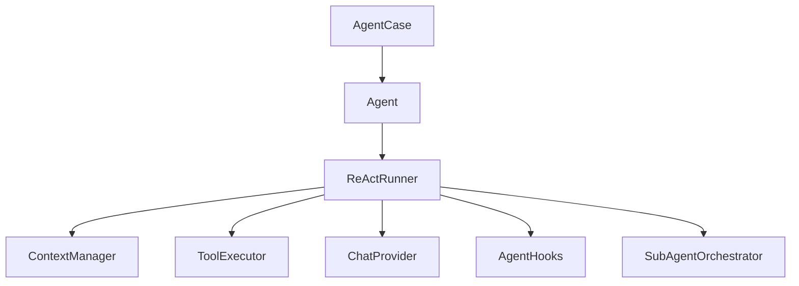
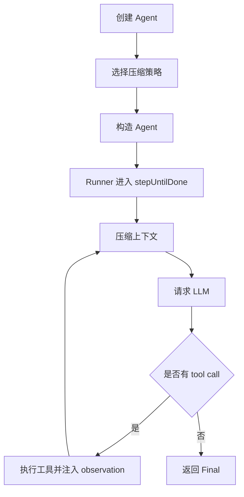

# Agent 模块

日期：2026-06-26

## 代码结构

- `Agent.kt`
- `AgentContext.kt`
- `AgentRunner.kt`
- `AgentResponse.kt`
- `AgentState.kt`
- `AgentHooks.kt`
- `CompressStrategy.kt`
- `AgentCase.kt`
- `runner/ReActRunner.kt`
- `context/ContextManager.kt`
- `context/ContextCompressStrategy.kt`
- `context/RoundTruncationStrategy.kt`
- `context/TokenWindowStrategy.kt`
- `context/LLMCompressStrategy.kt`
- `context/TokenCounter.kt`
- `orchestration/SubAgentOrchestrator.kt`

## 暴露的 Case

- `AgentCase.createAgent(config)`

## 业务职责

Agent 模块负责把配置转换成可执行的 Agent 运行时对象，并承载 ReAct 执行、上下文压缩、hook 回调和子 Agent 编排。

## 结构图

## 流程图

