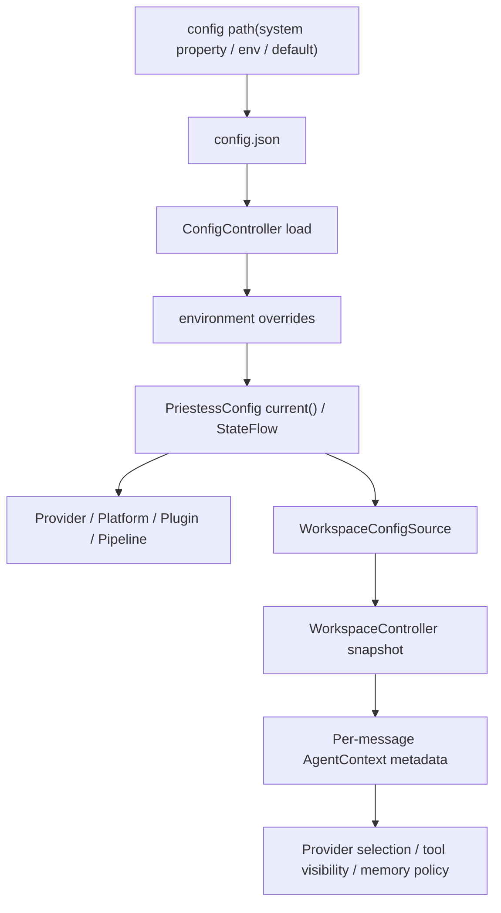
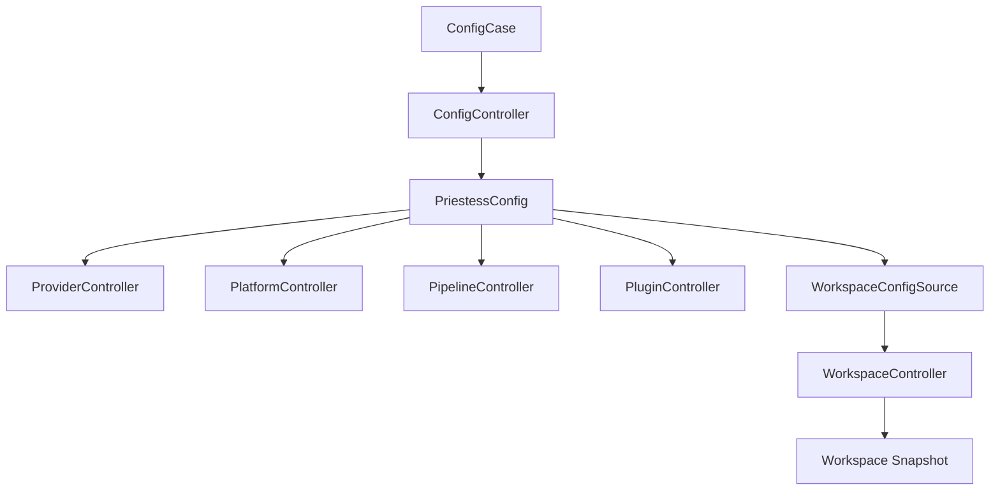
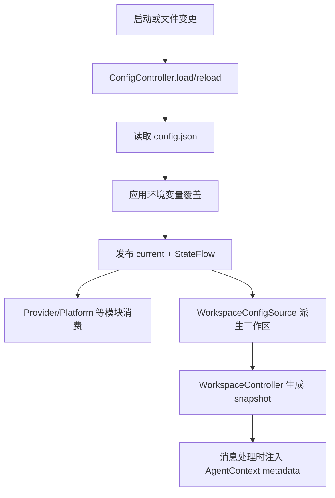

# Config 模块

日期：2026-06-26

这份文档聚焦项目的运行时配置体系，不讨论 Gradle、Vite、Dockerfile 这类工程配置；这里只看 `PriestessConfig` 及其来源、分发和生效边界。

## 代码结构

- `PriestessConfig.kt`
- `AgentConfig.kt`
- `DatabaseConfig.kt`
- `PlatformConfig.kt`
- `ProviderConfig.kt`
- `PipelineConfig.kt`
- `PluginConfig.kt`
- `ServerConfig.kt`
- `SubAgentConfig.kt`
- `ConfigController.kt`
- `ConfigCase.kt`

## 暴露的 Case

- `ConfigCase.current()`
- `ConfigCase.configPath()`
- `ConfigCase.update(...)`
- `ConfigCase.save(...)`
- `ConfigCase.replace(...)`
- `ConfigCase.reload()`
- `ConfigCase.listBackups()`
- `ConfigCase.restoreBackup(...)`
- `ConfigCase.*Flow`

## 业务职责

Config 模块聚合整套运行配置，负责：

- 读取磁盘上的 `config.json`
- 用环境变量覆盖部分字段
- 把总配置拆成多个领域 `StateFlow`
- 为运行时模块提供统一读取入口
- 支持配置文件监听、备份和恢复

## 运行时配置总览

运行时根配置是 `PriestessConfig`，当前聚合以下九类配置：

- `platforms`
- `providers`
- `agent`
- `database`
- `pipeline`
- `server`
- `plugins`
- `subAgents`
- `workspace`

结构入口见 [PriestessConfig.kt](/Users/heyanle/Desktop/project/astrbot.kt/src/main/kotlin/com/heyanle/priestess/bot/config/PriestessConfig.kt:10)。

## 配置项清单

### 1. `platforms`

定义聊天平台接入实例，模型见 [PlatformConfig.kt](/Users/heyanle/Desktop/project/astrbot.kt/src/main/kotlin/com/heyanle/priestess/bot/config/PlatformConfig.kt:9)。

主要字段：

- `name`：实例名
- `type`：平台类型，交给 `PlatformRegistry` 解析
- `enabled`：是否启用
- `host` / `port` / `wsPort`
- `token`
- `baseUrl`
- `useWs`
- `config`：扩展键值

当前内置平台注册见 [Platforms.kt](/Users/heyanle/Desktop/project/astrbot.kt/src/main/kotlin/com/heyanle/priestess/bot/platform/Platforms.kt:6)。

### 2. `providers`

定义 LLM 提供商实例，模型见 [ProviderConfig.kt](/Users/heyanle/Desktop/project/astrbot.kt/src/main/kotlin/com/heyanle/priestess/bot/config/ProviderConfig.kt:9)。

主要字段：

- `name`：实例名
- `type`：Provider 类型
- `model`：默认模型名
- `baseUrl`
- `apiKey`
- `enabled`
- `config`：扩展键值

当前内置 Provider 注册见 [BuiltinProviders.kt](/Users/heyanle/Desktop/project/astrbot.kt/src/main/kotlin/com/heyanle/priestess/bot/provider/BuiltinProviders.kt:7)。

API Key 额外支持运行时环境变量覆盖：

- `PRIESTESS_API_KEY_<PROVIDER_NAME>`
- `PRIESTESS_API_KEY`

解析逻辑见 [ProviderConfig.kt](/Users/heyanle/Desktop/project/astrbot.kt/src/main/kotlin/com/heyanle/priestess/bot/config/ProviderConfig.kt:18)。

### 3. `agent`

定义主 Agent 的默认运行参数，模型见 [AgentConfig.kt](/Users/heyanle/Desktop/project/astrbot.kt/src/main/kotlin/com/heyanle/priestess/bot/config/AgentConfig.kt:9)。

主要字段：

- `name`
- `instructions`
- `model`
- `providerName`
- `maxSteps`
- `temperature`
- `compressStrategy`
- `maxRounds`
- `maxTokens`
- `toolTimeoutSeconds`
- `enabledTools`
- `disabledTools`
- `allowedRiskLevels`

`AgentController` 会把这些字段转换为运行时 `Agent`，见 [AgentController.kt](/Users/heyanle/Desktop/project/astrbot.kt/src/main/kotlin/com/heyanle/priestess/bot/agent/AgentController.kt:10)。

### 4. `database`

定义数据库路径，模型见 [DatabaseConfig.kt](/Users/heyanle/Desktop/project/astrbot.kt/src/main/kotlin/com/heyanle/priestess/bot/config/DatabaseConfig.kt:9)。

当前只有一个核心字段：

- `path`

### 5. `pipeline`

定义消息流水线行为，模型见 [PipelineConfig.kt](/Users/heyanle/Desktop/project/astrbot.kt/src/main/kotlin/com/heyanle/priestess/bot/config/PipelineConfig.kt:9)。

主要字段：

- `wakingPrefix`
- `whitelistEnabled`
- `whitelistUsers`
- `whitelistGroups`
- `rateLimitEnabled`
- `rateLimitPerMinute`
- `sessionEnabledByDefault`
- `contentSafetyEnabled`
- `maxHistoryMessages`

这些配置分别被各个 pipeline stage 使用，入口组装见 [PipelineController.kt](/Users/heyanle/Desktop/project/astrbot.kt/src/main/kotlin/com/heyanle/priestess/bot/pipeline/PipelineController.kt:188)。

### 6. `server`

定义 Dashboard / HTTP API 服务端行为，模型见 [ServerConfig.kt](/Users/heyanle/Desktop/project/astrbot.kt/src/main/kotlin/com/heyanle/priestess/bot/config/ServerConfig.kt:9)。

主要字段：

- `enabled`
- `host`
- `port`
- `corsEnabled`
- `configWatchEnabled`
- `configWatchIntervalMillis`
- `apiToken`

Ktor 服务创建入口见 [PriestessBotServer.kt](/Users/heyanle/Desktop/project/astrbot.kt/src/main/kotlin/com/heyanle/priestess/bot/server/PriestessBotServer.kt:25)。

### 7. `plugins`

定义插件目录和自动发现策略，模型见 [PluginConfig.kt](/Users/heyanle/Desktop/project/astrbot.kt/src/main/kotlin/com/heyanle/priestess/bot/config/PluginConfig.kt:9)。

主要字段：

- `enabled`
- `directory`
- `autoDiscover`

插件发现逻辑见 [PluginController.kt](/Users/heyanle/Desktop/project/astrbot.kt/src/main/kotlin/com/heyanle/priestess/bot/plugin/PluginController.kt:30)。

### 8. `subAgents`

定义子 Agent 编排配置，模型见 [SubAgentConfig.kt](/Users/heyanle/Desktop/project/astrbot.kt/src/main/kotlin/com/heyanle/priestess/bot/config/SubAgentConfig.kt:9)。

顶层字段：

- `enabled`
- `defaultAgentName`
- `agents`
- `routes`

其中：

- `agents` 是候选子 Agent 列表
- `routes` 定义关键字路由、目标 Agent 和优先级

编排选择逻辑见 [SubAgentOrchestrator.kt](/Users/heyanle/Desktop/project/astrbot.kt/src/main/kotlin/com/heyanle/priestess/bot/agent/orchestration/SubAgentOrchestrator.kt:21)。

### 9. `workspace`

定义工作区目录运行时入口，模型见 [WorkspaceRuntimeConfig.kt](/Users/heyanle/Desktop/project/astrbot.kt/src/main/kotlin/com/heyanle/priestess/bot/config/WorkspaceRuntimeConfig.kt:6)。

主要字段：

- `defaultDir`

`defaultDir` 指向一个 workspace 目录。该目录在运行时按约定读取：

- `config.yaml`
- `skills/`
- `mcpserver.json`

目录解析和快照生成入口见 [WorkspaceController.kt](/Users/heyanle/Desktop/project/astrbot.kt/src/main/kotlin/com/heyanle/priestess/bot/workspace/WorkspaceController.kt:16) 与 [WorkspaceDirectoryLoader.kt](/Users/heyanle/Desktop/project/astrbot.kt/src/main/kotlin/com/heyanle/priestess/bot/workspace/WorkspaceDirectoryLoader.kt:18)。

## 配置来源架构

项目当前的运行时配置来源可以理解为 6 层：

### 第 1 层：配置文件路径来源

`ConfigController` 按以下优先级决定配置文件路径：

1. JVM 属性 `priestess.config.path`
2. 环境变量 `PRIESTESS_CONFIG_PATH`
3. 默认值 `config.json`

逻辑见 [ConfigController.kt](/Users/heyanle/Desktop/project/astrbot.kt/src/main/kotlin/com/heyanle/priestess/bot/config/ConfigController.kt:273)。

### 第 2 层：磁盘 JSON 配置

配置文件内容反序列化为单个 `PriestessConfig`。

加载行为：

- 文件不存在：生成默认配置并写回磁盘
- 文件为空：回填默认配置
- 文件带 UTF-8 BOM：自动清理后解析
- 文件损坏：备份为 `config.json.bak`，再回退默认配置

逻辑见 [ConfigController.kt](/Users/heyanle/Desktop/project/astrbot.kt/src/main/kotlin/com/heyanle/priestess/bot/config/ConfigController.kt:149)。

### 第 3 层：环境变量覆盖

当前 `ConfigController` 只覆盖三类配置：

- `server.*`
- `database.path`
- `plugins.*`

对应环境变量：

- `PRIESTESS_SERVER_ENABLED`
- `PRIESTESS_SERVER_HOST`
- `PRIESTESS_SERVER_PORT`
- `PRIESTESS_SERVER_CORS_ENABLED`
- `PRIESTESS_CONFIG_WATCH_ENABLED`
- `PRIESTESS_CONFIG_WATCH_INTERVAL_MILLIS`
- `PRIESTESS_SERVER_API_TOKEN`
- `PRIESTESS_DATABASE_PATH`
- `PRIESTESS_PLUGINS_ENABLED`
- `PRIESTESS_PLUGINS_DIRECTORY`
- `PRIESTESS_PLUGINS_AUTO_DISCOVER`

逻辑见 [ConfigController.kt](/Users/heyanle/Desktop/project/astrbot.kt/src/main/kotlin/com/heyanle/priestess/bot/config/ConfigController.kt:175)。

注意：

- Provider 的 `apiKey` 不经过这里统一覆盖
- Provider 的密钥在 Provider 实际发请求时单独解析环境变量

### 第 4 层：内存总配置与领域 Flow

加载完成后，`ConfigController` 会把总配置拆成多个 `StateFlow`：

- `configFlow`
- `databaseConfigFlow`
- `platformConfigsFlow`
- `providerConfigsFlow`
- `agentConfigFlow`
- `pipelineConfigFlow`
- `serverConfigFlow`
- `pluginConfigFlow`
- `subAgentConfigFlow`

发布逻辑见 [ConfigController.kt](/Users/heyanle/Desktop/project/astrbot.kt/src/main/kotlin/com/heyanle/priestess/bot/config/ConfigController.kt:137)。

### 第 5 层：Workspace 派生层

`workspaces` 是运行时里最重要的一层二次配置。

来源规则：

- 如果 `PriestessConfig.workspaces` 非空，直接使用
- 如果为空，从全局 `agent`、`subAgents` 和 tool 白名单派生一个默认 workspace

逻辑见 [WorkspaceConfigSource.kt](/Users/heyanle/Desktop/project/astrbot.kt/src/main/kotlin/com/heyanle/priestess/bot/workspace/WorkspaceConfigSource.kt:15)。

### 第 6 层：Workspace Snapshot 运行态

`WorkspaceController` 不直接把 `WorkspaceConfig` 交给下游，而是先编译成 snapshot：

- 校验 workspace 是否有效
- 解析技能列表
- 解析工具可见集
- 解析 MCP server 及其运行时工具
- 计算 memory policy
- 生成稳定的 `providerName`、`toolNames`、`skillNames`

逻辑见 [WorkspaceController.kt](/Users/heyanle/Desktop/project/astrbot.kt/src/main/kotlin/com/heyanle/priestess/bot/workspace/WorkspaceController.kt:174)。

## 配置分发和消费链路

### DI 装配

配置模块先于大多数模块初始化，装配见 [CoreModule.kt](/Users/heyanle/Desktop/project/astrbot.kt/src/main/kotlin/com/heyanle/priestess/bot/core/di/CoreModule.kt:57)。

典型依赖关系：

- `DatabaseController` 读取 `configCase.current().database.path`
- `ProviderController` 监听 `providerConfigsFlow`
- `PlatformController` 监听 `platformConfigsFlow`
- `PluginController` 启动时读取 `plugins`
- `PipelineController` 每次构建阶段时读取 `current()`
- `WorkspaceController` 从 `ConfigBackedWorkspaceConfigSource` 加载 `workspaces`
- `PriestessBotServer` 启动时读取 `current().server`

### 消息处理期

消息进入 Pipeline 后，配置会继续经过一次“运行时解析”：

1. `PipelineController` 用当前 `configCase.current()` 组装 stage 列表
2. `PreProcessStage` 先解析 workspace
3. workspace snapshot 决定本次消息使用的 `agent/provider/tools/memory/subAgents`
4. `ProcessStage` 从 metadata 中优先拿 `provider_name/providerName`
5. `ReActRunner` 只向 LLM 暴露当前 workspace 可见的工具

入口代码：

- [PipelineController.kt](/Users/heyanle/Desktop/project/astrbot.kt/src/main/kotlin/com/heyanle/priestess/bot/pipeline/PipelineController.kt:200)
- [PreProcessStage.kt](/Users/heyanle/Desktop/project/astrbot.kt/src/main/kotlin/com/heyanle/priestess/bot/pipeline/stages/PreProcessStage.kt:78)
- [ProcessStage.kt](/Users/heyanle/Desktop/project/astrbot.kt/src/main/kotlin/com/heyanle/priestess/bot/pipeline/stages/ProcessStage.kt:42)

## 热更新与生效边界

这部分是理解系统最容易踩坑的地方。

### 可以直接跟随 config 变化的

- `providers`
  通过 `providerConfigsFlow` 监听，后续查询会拿到新的 Provider 实例，见 [ProviderController.kt](/Users/heyanle/Desktop/project/astrbot.kt/src/main/kotlin/com/heyanle/priestess/bot/provider/ProviderController.kt:18)。

- `platforms.enabled` 的启停
  `PlatformController` 会根据启用列表启动或停止平台，见 [PlatformController.kt](/Users/heyanle/Desktop/project/astrbot.kt/src/main/kotlin/com/heyanle/priestess/bot/platform/PlatformController.kt:39)。

- `agent`、`pipeline`、`subAgents`
  这些不是通过独立 flow 实时改已有对象，而是“后续新消息”进入 Pipeline 时使用新的 `current()` 值，见 [PipelineController.kt](/Users/heyanle/Desktop/project/astrbot.kt/src/main/kotlin/com/heyanle/priestess/bot/pipeline/PipelineController.kt:200)。

### 需要显式 reload 的

- `workspaces`
  workspace 进入运行时前会被编译成 snapshot，不会自动跟着 `configFlow` 变化；需要调用 `WorkspaceCase.reload(...)` 或 `reloadAll()`，见 [WorkspaceCase.kt](/Users/heyanle/Desktop/project/astrbot.kt/src/main/kotlin/com/heyanle/priestess/bot/workspace/WorkspaceCase.kt:8)。

### 启动期绑定，当前不算真正热更新的

- `database.path`
  `DatabaseController` 在 DI 初始化时读取一次，见 [CoreModule.kt](/Users/heyanle/Desktop/project/astrbot.kt/src/main/kotlin/com/heyanle/priestess/bot/core/di/CoreModule.kt:62)。

- `server`
  `PriestessBotServer` 在创建时注入一份 `ServerConfig`，不会因为 `serverConfigFlow` 更新而自动重建 HTTP 服务，见 [CoreModule.kt](/Users/heyanle/Desktop/project/astrbot.kt/src/main/kotlin/com/heyanle/priestess/bot/core/di/CoreModule.kt:191)、[PriestessBotServer.kt](/Users/heyanle/Desktop/project/astrbot.kt/src/main/kotlin/com/heyanle/priestess/bot/server/PriestessBotServer.kt:25)。

- 已启动平台的连接参数
  当前 `PlatformController` 主要按“名字是否还启用”同步，对同名实例的 `host/port/token` 变化不会自动重建连接。

- `plugins.enabled/autoDiscover`
  启动时会读一次，后续不会因为配置文件更新而自动重新 discover。

## 备份、恢复和文件监听

### 备份

每次 `save()` / `replace(persist = true)` 之前，如果当前配置文件存在且非空，会先在：

- `backups/<config-file-name>/`

下生成一个时间戳备份文件。

逻辑见 [ConfigController.kt](/Users/heyanle/Desktop/project/astrbot.kt/src/main/kotlin/com/heyanle/priestess/bot/config/ConfigController.kt:222)。

### 恢复

`restoreBackup(id)` 会：

1. 从备份目录读取指定备份
2. 覆盖当前配置文件
3. 调用 `reload()` 重新发布内存配置

逻辑见 [ConfigController.kt](/Users/heyanle/Desktop/project/astrbot.kt/src/main/kotlin/com/heyanle/priestess/bot/config/ConfigController.kt:106)。

### 文件监听

如果 `server.configWatchEnabled = true`，`ConfigController` 会启动一个轮询 watcher，按 `configWatchIntervalMillis` 检测配置文件 `lastModified` 变化并执行 `reload()`，见 [ConfigController.kt](/Users/heyanle/Desktop/project/astrbot.kt/src/main/kotlin/com/heyanle/priestess/bot/config/ConfigController.kt:121)。

注意：

- watcher 监听的是配置文件本身
- watcher 只负责重载 `ConfigController`
- workspace、server、database 这类二级运行态不会因此自动全部重建

## 当前架构的关键认识

可以把项目的运行时配置理解成下面这条链：

## 与 Dashboard 前端概念的关系

前端类型里已经出现了：

- database layer
- environment layer
- working directory
- effective runtime preview

这些词更像“目标中的分层配置 UI 模型”。

但当前后端主实现仍以单一 `PriestessConfig` 为核心，公开的稳定 API 也仍以 `/api/config`、`/api/config/reload`、`/api/config/backups` 为主，见 [DashboardRoutes.kt](/Users/heyanle/Desktop/project/astrbot.kt/src/main/kotlin/com/heyanle/priestess/bot/server/DashboardRoutes.kt:37)。

理解现状时要区分：

- 已落地的运行时 config 体系
- Dashboard 前端正在推进的分层配置体验

## 结构图

## 流程图

