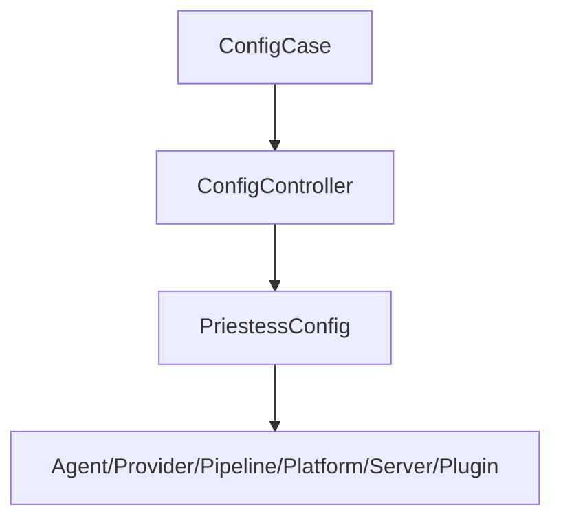
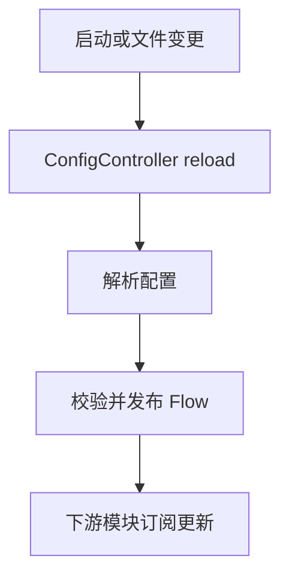

# Config 模块

日期：2026-06-26

## 代码结构

- `PriestessConfig.kt`
- `AgentConfig.kt`
- `DatabaseConfig.kt`
- `PlatformConfig.kt`
- `ProviderConfig.kt`
- `PipelineConfig.kt`
- `PluginConfig.kt`
- `ServerConfig.kt`
- `SubAgentConfig.kt`
- `ConfigController.kt`
- `ConfigCase.kt`

## 暴露的 Case

- `ConfigCase.current()`
- `ConfigCase.update(...)`
- `ConfigCase.save(...)`
- `ConfigCase.reload()`
- `ConfigCase.*Flow`

## 业务职责

Config 模块聚合整套运行配置，负责读取、写入、替换、热更新和流式分发。

## 结构图

## 流程图

