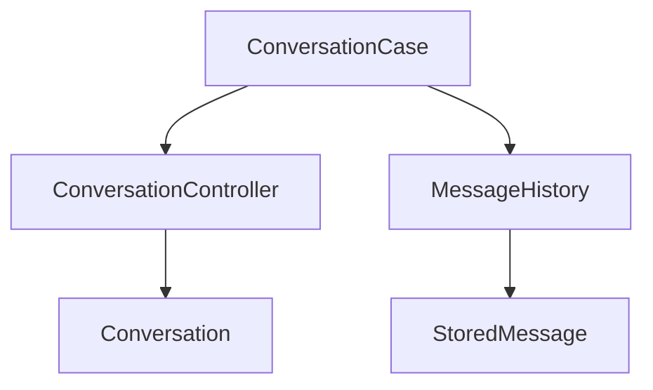
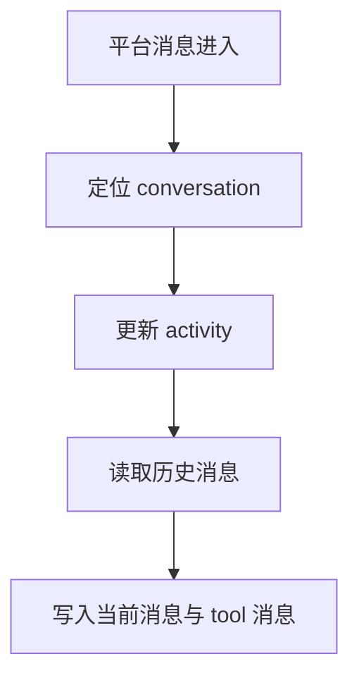

# Conversation 模块

日期：2026-06-26

## 代码结构

- `Conversation.kt`
- `ConversationController.kt`
- `ConversationCase.kt`
- `MessageHistory.kt`

## 暴露的 Case

- `ConversationCase.getOrCreate(...)`
- `ConversationCase.updateActivity(...)`
- `ConversationCase.getRecentMessages(...)`
- `ConversationCase.getAll()`
- `ConversationCase.getMessages(...)`
- `ConversationCase.searchMessages(...)`
- `ConversationCase.storeMessage(...)`

## 业务职责

Conversation 模块负责会话实体、消息历史、消息检索和活动时间维护，是消息流和 Agent 上下文的重要数据入口。

## 结构图

## 流程图

