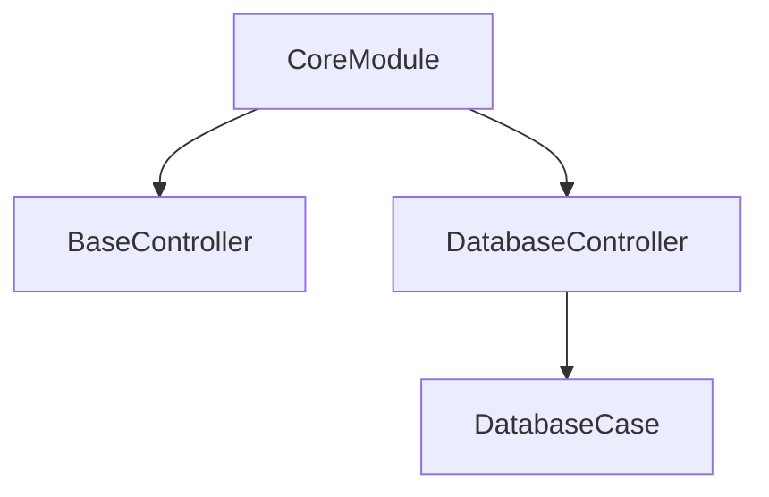
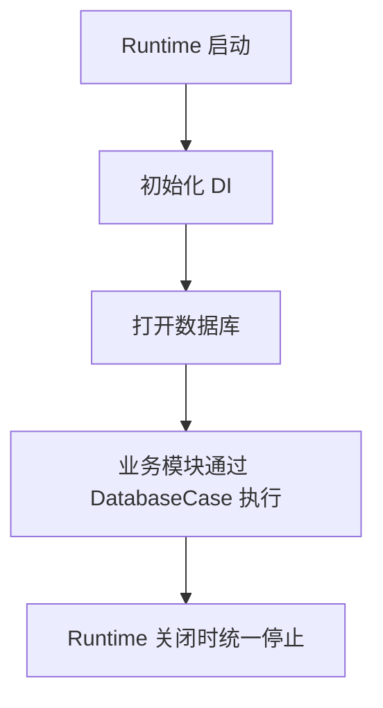

# Core 模块

日期：2026-06-26

## 代码结构

- `controller/BaseController.kt`
- `db/Database.kt`
- `db/DatabaseController.kt`
- `db/DatabaseCase.kt`
- `di/CoreModule.kt`

## 暴露的 Case

- `DatabaseCase.execute(...)`

## 业务职责

Core 模块提供运行时基础设施：控制器生命周期、数据库执行门面和 DI 组装。

## 结构图

## 流程图

