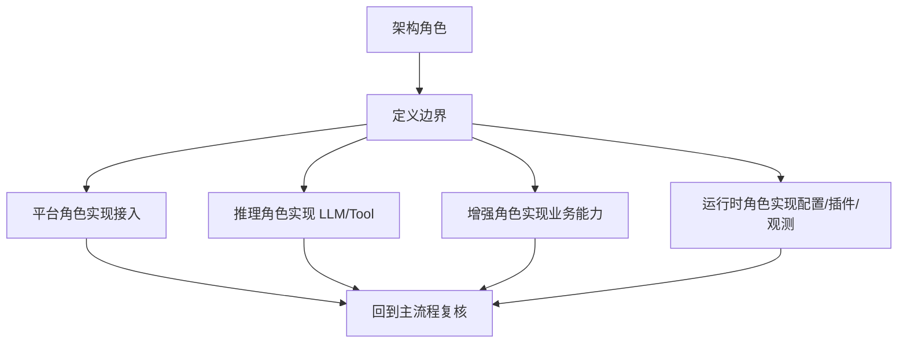

# 开发者上手手册

日期：2026-06-26

这份文档的目标很直接：读完以后，开发者知道先看哪里、改哪里、怎么交接给别的角色。

## 先从哪里开始

1. 先看 [getting-started-architecture.md](./getting-started-architecture.md) 建立全局地图。
2. 再看 [navigation-map.md](./navigation-map.md) 把需求映射到模块。
3. 然后看 [message-flow.md](./message-flow.md) 和 [llm-flow.md](./llm-flow.md) 理解主链路。
4. 最后进入具体模块页，优先顺序通常是 `core`、`config`、`platform`、`pipeline`、`agent`、`tool`、`provider`。

## 第一批必读文件

- `src/main/kotlin/com/heyanle/priestess/bot/PriestessRuntime.kt`
- `src/main/kotlin/com/heyanle/priestess/bot/core/di/CoreModule.kt`
- `src/main/kotlin/com/heyanle/priestess/bot/pipeline/PipelineController.kt`
- `src/main/kotlin/com/heyanle/priestess/bot/agent/runner/ReActRunner.kt`
- `src/main/kotlin/com/heyanle/priestess/bot/tool/ToolExecutor.kt`
- `src/main/kotlin/com/heyanle/priestess/bot/provider/ProviderController.kt`
- `src/main/kotlin/com/heyanle/priestess/bot/workspace/WorkspaceController.kt`

## 改动前先判断落点

### 改消息接入

- 优先看 `platform`。
- 如果是事件形态变了，改 adapter。
- 如果是消息处理顺序变了，改 `pipeline`。
- 如果是回复格式变了，改 `RespondStage` 或平台发送实现。

### 改 LLM 行为

- 优先看 `agent`、`provider`、`tool`。
- 如果是上下文长度或截断策略，改 `agent/context`。
- 如果是 tool call 解析或执行，改 `ToolExecutor`。
- 如果是模型接入，改 `provider/adapters/*`。

### 改业务能力

- 知识相关，进 `knowledge`。
- 长期记忆相关，进 `memory`。
- 提醒相关，进 `reminder`。
- persona 相关，进 `persona`。

### 改运行时治理

- 配置变更，进 `config`。
- 插件生命周期，进 `plugin`。
- workspace 裁剪、快照、重载，进 `workspace`。
- 指标和健康状态，进 `observability` 和 `server`。

## 角色交接规则

## 常见改动路径

### 增加一个新的平台消息字段

1. 改平台 adapter。
2. 补 `MessageEvent` 相关映射。
3. 检查 pipeline 是否需要新条件。
4. 更新 `message-flow.md`。

### 增加一个新的 LLM 工具

1. 在 `tool` 下实现 `FunctionTool`。
2. 注册到 `ToolController` 或 builtin 工具集合。
3. 确认 `ToolPolicy` 允许执行。
4. 更新 `llm-flow.md` 和对应模块页。

### 增加一个新的 workspace 能力

1. 先改 `workspace` 配置模型。
2. 更新快照构建逻辑。
3. 检查 `skill` / `tool` / `persona` 的裁剪逻辑。
4. 如果影响运行时，再补 `config` 或 `server` 说明。

## 新人开发建议

- 先改 `Case` 再碰 `Controller` 内部实现。
- 先补文档再扩代码路径，避免新能力藏在隐式逻辑里。
- 改动如果跨三个以上模块，先画流程，再写代码。
- 交付前回到横切流程页，确认没有破坏主链路。
