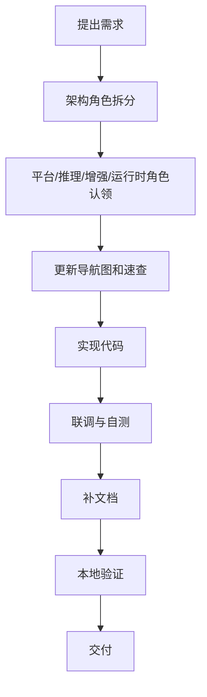
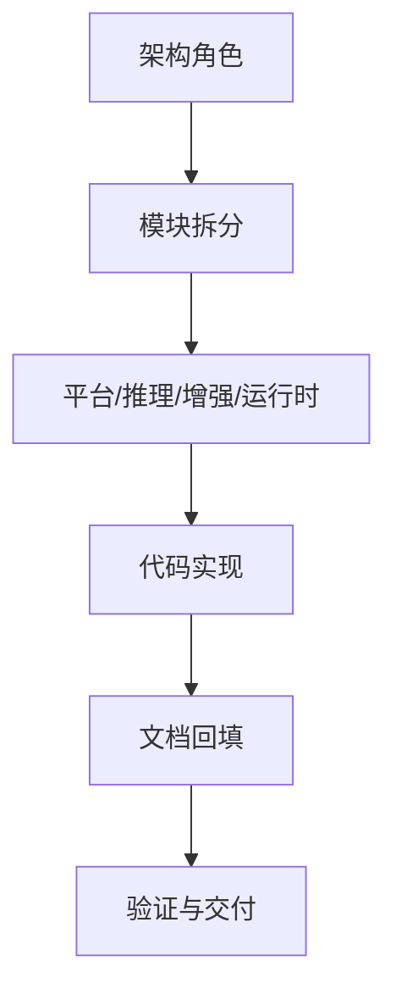

# 功能交付工作流

日期：2026-06-26

这份文档描述一个新功能从想法到落地的完整协作流程，适合按角色推进。

## 工作流总览

## 阶段说明

### 1. 提出需求

- 输入：一个想做的功能或修复点。
- 输出：需求描述、期望行为、影响面。

### 2. 架构拆分

- 由架构角色判断需求落在哪个模块。
- 如有跨模块影响，先画边界和流程。
- 输出：模块选择、`Case` 入口、相关文件列表。

### 3. 角色认领

- 平台角色负责消息入口和回包。
- 推理角色负责 Agent / Provider / Tool / Skill。
- 增强角色负责 Knowledge / Memory / Reminder / Persona。
- 运行时角色负责 Config / Plugin / Workspace / Observability。

### 4. 更新文档

- 先更新 `navigation-map.md` 或对应模块页。
- 横切行为变化时，更新 `message-flow.md` 或 `llm-flow.md`。
- 若涉及多人协作，补 `multi-role-collaboration.md`。

### 5. 实现代码

- 优先改 `Case`，再进入 `Controller` 和内部实现。
- 复杂逻辑先保留边界，避免直接跨包操作内部状态。

### 6. 联调与自测

- 跑单元测试。
- 跑必要的本地启动和 Dashboard 构建。
- 验证链路有没有断在平台、pipeline、Agent 或 workspace。

### 7. 交付前检查

- 代码改动是否和文档一致。
- 关键入口是否仍然能在导航图里找到。
- 本地开发和验证页里的命令是否可用。

## 角色交接

## 完成标准

- 功能行为可用。
- 文档能带新人定位到代码。
- 交接链路清晰。
- 验证步骤明确。

## 适用场景

- 新功能开发。
- 跨模块重构。
- 流程调整。
- 交接给另一个角色继续推进。

