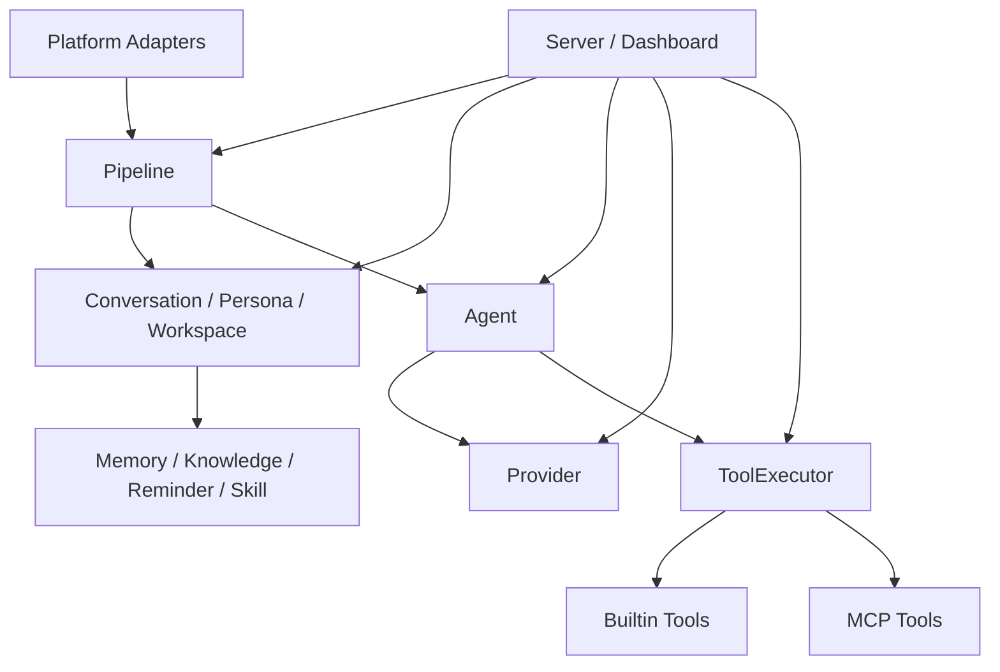
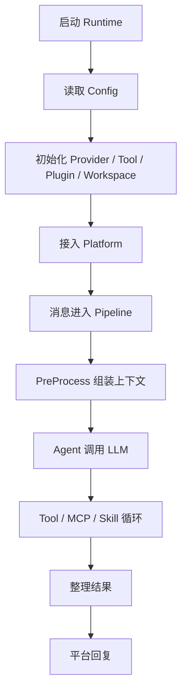

# PriestessBot 架构导读

日期：2026-06-26

这份文档给第一次接触仓库的开发者使用，目标是先建立整体地图，再进入模块级实现。

## 先看什么

1. [message-flow.md](./message-flow.md) 先理解消息是怎么进系统、怎么出去的。
2. [llm-flow.md](./llm-flow.md) 再看 Agent、上下文、工具和 MCP 怎么协作。
3. 再按模块查看 `platform`、`pipeline`、`agent`、`tool`、`provider`、`workspace`。

## 一句话架构

PriestessBot 是一个以平台消息为入口、以 Pipeline 为中枢、以 Agent/Tool/Provider 为推理执行层、以 Workspace/Skill/Persona/Memory 为作用域与增强层的 Kotlin LLM Bot 框架。

## 总体分层

## 核心运行顺序

## 模块阅读顺序

- `core`：先看运行时和基础设施。
- `config`：再看配置如何驱动整个系统。
- `platform` + `pipeline`：理解消息入口和处理链。
- `conversation` + `persona` + `workspace`：理解会话、角色和作用域。
- `agent` + `provider` + `tool` + `skill`：理解推理执行面。
- `knowledge` + `memory` + `reminder`：理解能力增强模块。
- `plugin` + `server` + `observability`：理解扩展、运维和观测。

## 开发者入门建议

1. 先找对应模块的 `Case`，不要直接跨包碰 `Controller`。
2. 先看 `Case` 暴露的稳定方法，再深入内部实现。
3. 看流程图时，优先关注数据怎么流，而不是类名本身。
4. 新增能力时，优先落在现有模块边界内，必要时再补横切文档。

## 代码阅读入口

- [`docs/2026-06-26/index.md`](./index.md)
- [`docs/2026-06-26/developer-playbook.md`](./developer-playbook.md)
- [`docs/2026-06-26/message-flow.md`](./message-flow.md)
- [`docs/2026-06-26/llm-flow.md`](./llm-flow.md)
