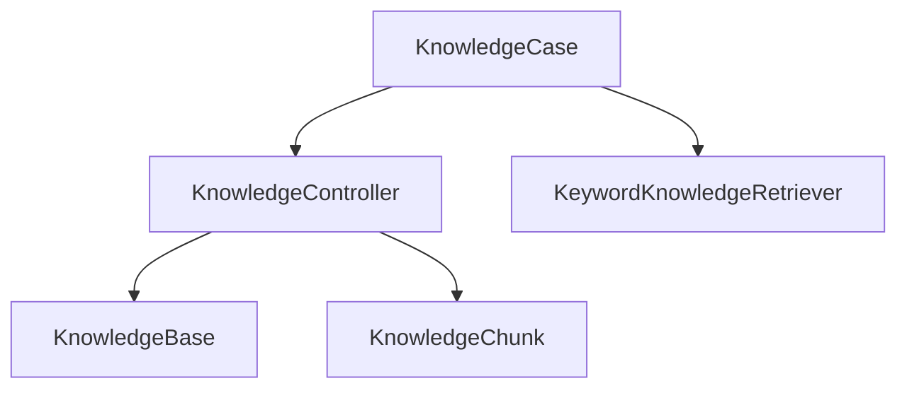
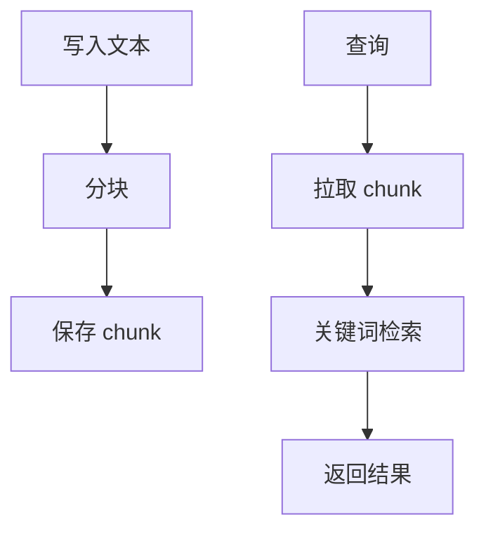

# Knowledge 模块

日期：2026-06-26

## 代码结构

- `KnowledgeModels.kt`
- `KnowledgeController.kt`
- `KnowledgeCase.kt`
- `KeywordKnowledgeRetriever.kt`

## 暴露的 Case

- `KnowledgeCase.createBase(...)`
- `KnowledgeCase.listBases()`
- `KnowledgeCase.addTextDocument(...)`
- `KnowledgeCase.search(...)`

## 业务职责

Knowledge 模块提供知识库、分块、关键词检索和 Agent 可调用的知识查询能力。

## 结构图

## 流程图

