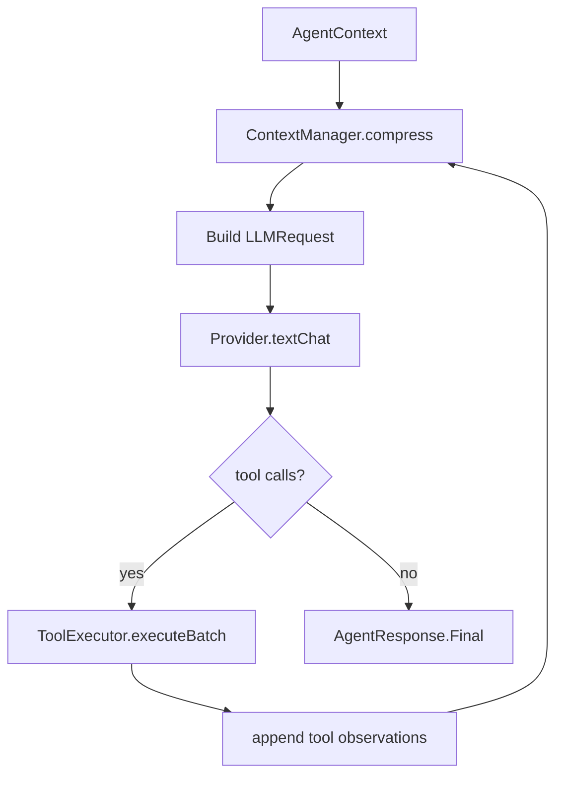
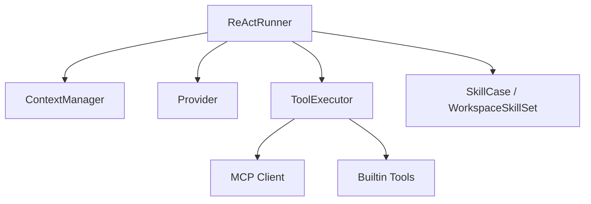

# LLM 流程

日期：2026-06-26

这份文档描述 Agent 调用 LLM、压缩上下文、处理 tool call、注入 skill、以及 MCP 工具如何进入执行链。

## 主链路

## 上下文管理

- `ContextManager` 根据 `Agent.compressStrategy` 选择压缩策略。
- 支持 `ROUND_TRUNCATION`、`TOKEN_WINDOW`、`LLM_COMPRESS`。
- 压缩目标由 `maxContextTokens` 和 `maxContextRounds` 共同决定。
- `ReActRunner` 在每轮请求前都刷新 system message。

## Skill 注入

- `SkillCase.getWorkspaceSkillState(...)` 根据 workspace snapshot 计算可用 skill。
- `WorkspaceSkillSet.documents()` 生成 markdown prompt 文档。
- `ReActRunner.buildSystemPrompt()` 把 skill 文档拼入 system prompt。
- `Skill.dispatch(...)` 可作为独立的消息派发能力。

## Tool 和 MCP

- `ToolController` 管理注册的 function tools。
- `ToolExecutor` 负责参数解析、校验、policy 判定、超时和 metrics。
- builtin tools 提供 memory、reminder、knowledge、conversation、web search 等能力。
- `mcp` 子包提供 stdio / SSE / streamable HTTP 等传输。
- workspace 可以按配置拉起 MCP session，并把结果注入到可用工具集合。

## 结构图

## 业务流程

1. `Pipeline` 把当前消息组装为 `AgentContext`。
2. `ReActRunner` 先压缩上下文，再构造 `LLMRequest`。
3. Provider 返回普通回答或 tool calls。
4. 若有 tool calls，`ToolExecutor` 执行工具并把 observation 写回消息历史。
5. LLM 在新的上下文上继续推理，直到得到 Final 或超出步数。

