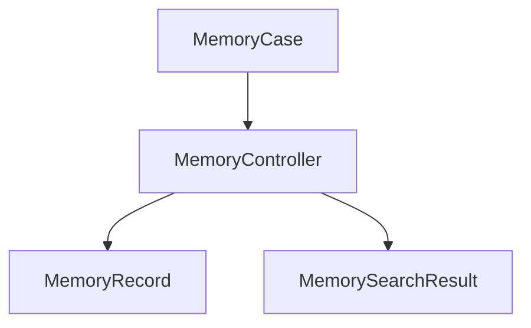
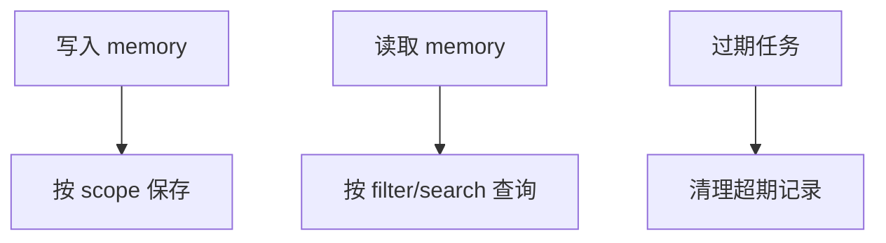

# Memory 模块

日期：2026-06-26

## 代码结构

- `MemoryModels.kt`
- `MemoryController.kt`
- `MemoryCase.kt`

## 暴露的 Case

- `MemoryCase.save(...)`
- `MemoryCase.list(...)`
- `MemoryCase.search(...)`
- `MemoryCase.delete(...)`
- `MemoryCase.expire(...)`

## 业务职责

Memory 模块负责长短期记忆的保存、检索、删除和过期清理，服务于 persona 和 agent 上下文增强。

## 结构图

## 流程图

