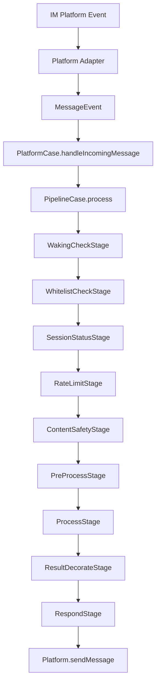
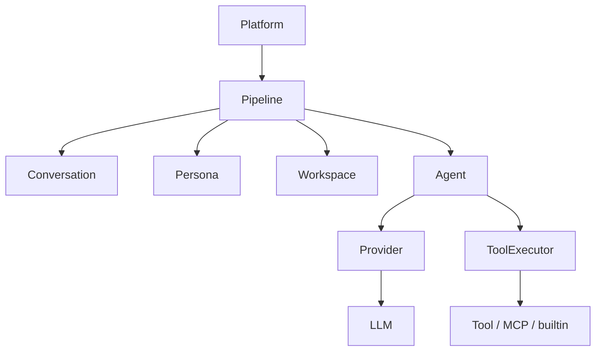

# 机器人消息进入系统到回复流程

日期：2026-06-26

这份文档描述消息从平台进入系统，到最终回复用户的完整路径。

## 主链路

## 关键参与模块

- `platform` 负责平台原生事件适配。
- `pipeline` 负责阶段编排。
- `conversation` 负责会话和消息存档。
- `persona` 负责 persona 注入。
- `workspace` 负责 workspace 作用域。
- `agent` 负责 LLM 执行。
- `tool` 负责工具执行。
- `provider` 负责模型接入。

## 业务拆解

1. 平台适配器把原生消息变成统一的 `MessageEvent`。
2. `PlatformCase` 把事件送入 `PipelineCase`。
3. Pipeline 先做唤醒、白名单、会话状态、限流和安全检查。
4. `PreProcessStage` 组装 conversation、workspace、persona、skill 和 agent 上下文。
5. `ProcessStage` 进入 Agent / LLM / tool 循环。
6. `ResultDecorateStage` 整理最终输出。
7. `RespondStage` 通过平台发送消息。

## 依赖图

