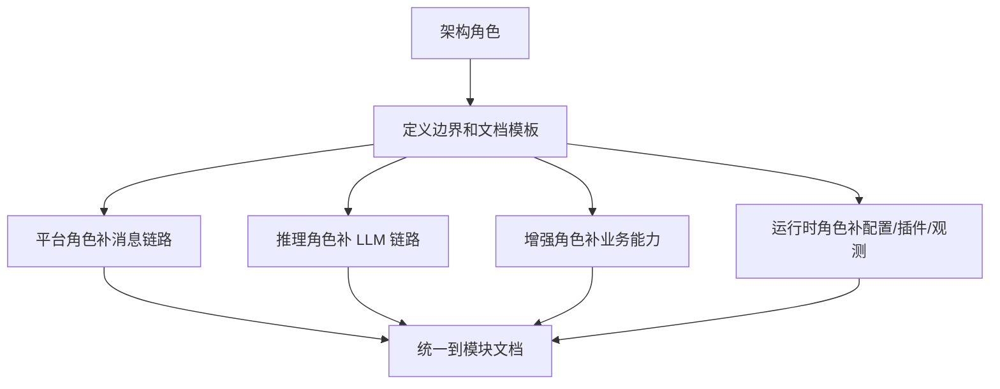
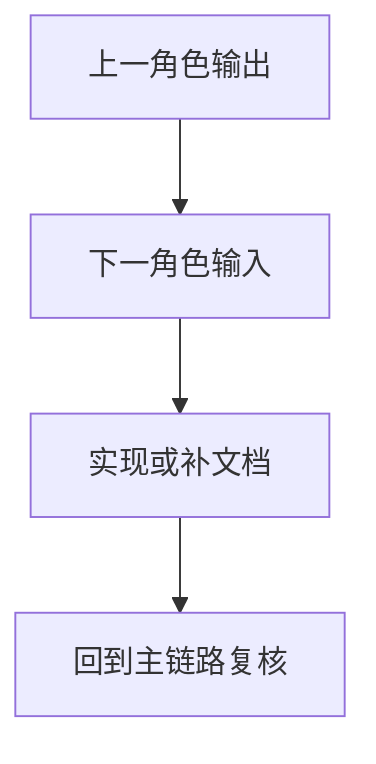

# 多角色协作指南

日期：2026-06-26

这份文档把开发工作拆成几个角色，方便多人协作，也方便单人按职责推进。

## 角色划分

### 架构角色

- 负责整体分层、模块边界、依赖方向和文档总览。
- 重点关注 `core`、`pipeline`、`agent`、`workspace`。
- 输出：模块边界图、术语表、文档模板、改动落点建议。
- 完成标准：新需求能被准确映射到模块和 `Case`。

### 平台角色

- 负责 IM 平台适配、消息标准化、回包和会话传递。
- 重点关注 `platform`、`conversation`、`server`。
- 输出：消息链路说明、平台事件字段约定、回包路径说明。
- 完成标准：新增或调整平台事件时，消息可以从入口稳定流到 pipeline。

### 推理角色

- 负责 LLM 调用链、上下文压缩、tool call、skill 注入和 MCP。
- 重点关注 `agent`、`provider`、`tool`、`skill`。
- 输出：LLM 调用链、上下文策略、工具执行约束、skill 注入规则。
- 完成标准：模型调用、工具调用和结果回写三段链路都能被说明并实现。

### 增强角色

- 负责知识、记忆、提醒、persona 等业务增强能力。
- 重点关注 `knowledge`、`memory`、`reminder`、`persona`。
- 输出：业务对象模型、存取路径、查询和投递流程。
- 完成标准：增强能力可以通过对应 `Case` 对外使用，并被主链路复用。

### 运行时角色

- 负责配置、插件、观测、工作区和生命周期治理。
- 重点关注 `config`、`plugin`、`observability`、`workspace`。
- 输出：配置/插件/观测/工作区生命周期说明。
- 完成标准：配置变更、插件启停、workspace 重载都有明确入口和可追踪状态。

## 推荐协作方式

## 任务分工建议

1. 先由架构角色确认模块边界和术语。
2. 平台角色补消息入口和回包路径。
3. 推理角色补 Agent、Context、Tool、MCP 链路。
4. 增强角色补知识、记忆、提醒和 persona。
5. 运行时角色补配置、插件、workspace 和 dashboard。

## 交接约定

### 典型交接

- 架构角色 -> 平台角色：边界图、术语表、消息链路入口。
- 架构角色 -> 推理角色：Agent/Tool/Provider 的依赖方向和约束。
- 平台角色 -> 推理角色：统一后的 `MessageEvent` 和会话上下文。
- 推理角色 -> 增强角色：可注入的上下文、skill、memory 和 tool 需求。
- 运行时角色 -> 所有人：配置、开关、生命周期和 reload 行为。

### 交接检查清单

- 需求是否能映射到一个主模块和一个 `Case`。
- 需要改的文件是否已经列出来。
- 上游输入和下游输出是否已经说明。
- 是否补了相关流程图或导航页。
- 是否能不看实现代码就知道从哪里改起。

## 最终产物

- 一组按模块拆分的架构文档。
- 两份横切流程文档。
- 一份新手导读。
- 一份开发者手册。
- 一份可直接用来拆工和交接的分工约定。

## 使用方式

开发前先读导读，再按角色认领相关模块文档，最后回到横切流程页确认自己改动的位置在整条链路中的上下游。

