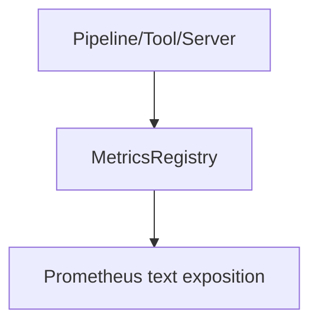
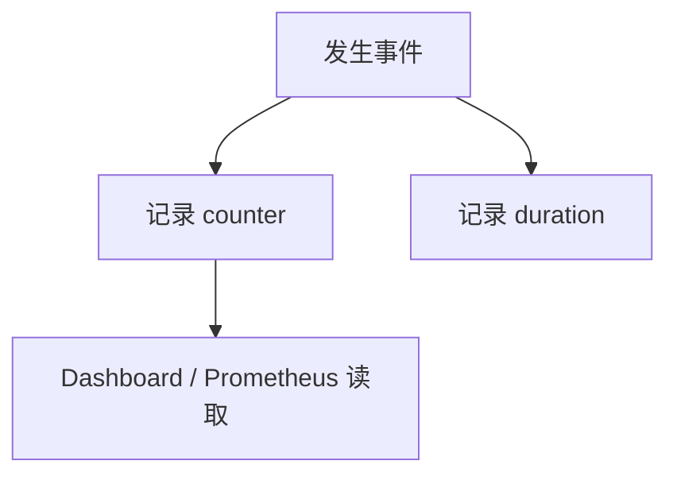

# Observability 模块

日期：2026-06-26

## 代码结构

- `MetricsRegistry.kt`

## 暴露的 Case

- 当前没有独立 `Case` 门面。

## 业务职责

Observability 模块提供轻量指标注册与导出能力，供 pipeline、tool、LLM 请求和运行时健康检查复用。

## 结构图

```mermaid
flowchart TD
    A[Pipeline/Tool/Server] --> B[MetricsRegistry]
    B --> C[Prometheus text exposition]
```

## 流程图

```mermaid
flowchart TD
    A[发生事件] --> B[记录 counter]
    A --> C[记录 duration]
    B --> D[Dashboard / Prometheus 读取]
```

