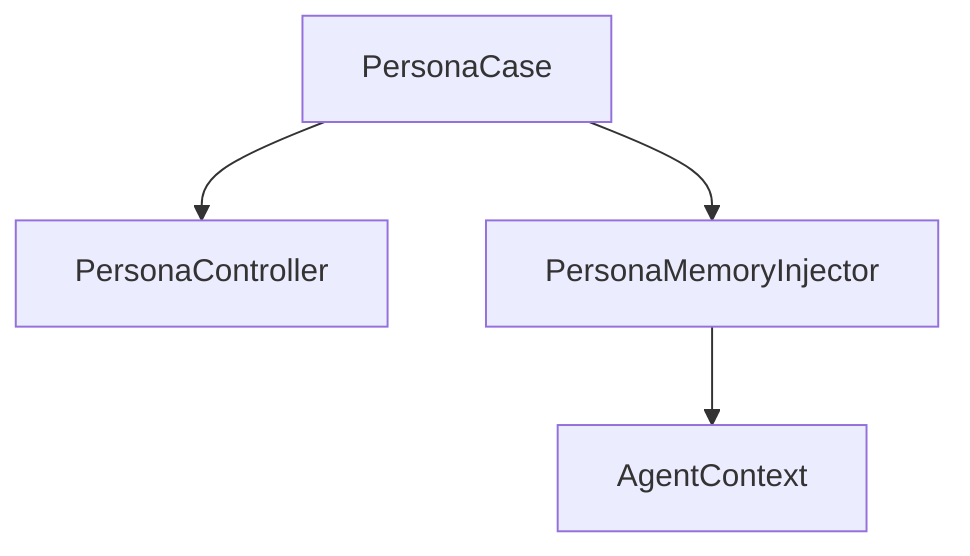
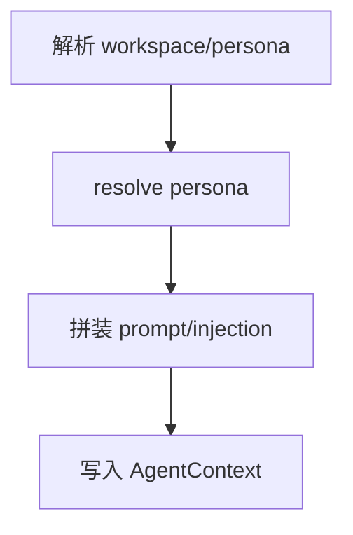

# Persona 模块

日期：2026-06-26

## 代码结构

- `PersonaModels.kt`
- `PersonaController.kt`
- `PersonaCase.kt`
- `PersonaMemoryInjector.kt`

## 暴露的 Case

- `PersonaCase.list(...)`
- `PersonaCase.get(...)`
- `PersonaCase.upsert(...)`
- `PersonaCase.delete(...)`
- `PersonaCase.resolve(...)`

## 业务职责

Persona 模块管理工作区维度的角色设定，并在 pipeline 中把 persona 与 memory 注入 AgentContext。

## 结构图

## 流程图

