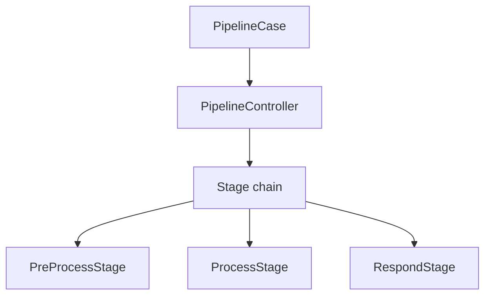
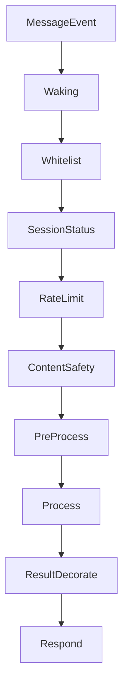

# Pipeline 模块

日期：2026-06-26

## 代码结构

- `Stage.kt`
- `PipelineContext.kt`
- `PipelineController.kt`
- `PipelineCase.kt`
- `stages/*.kt`

## 暴露的 Case

- `PipelineCase.process(event)`

## 业务职责

Pipeline 模块负责把平台消息组装成一条有序的处理链：唤醒、白名单、会话状态、限流、内容安全、预处理、LLM 处理、结果修饰和回复发送。

## 结构图

## 流程图

