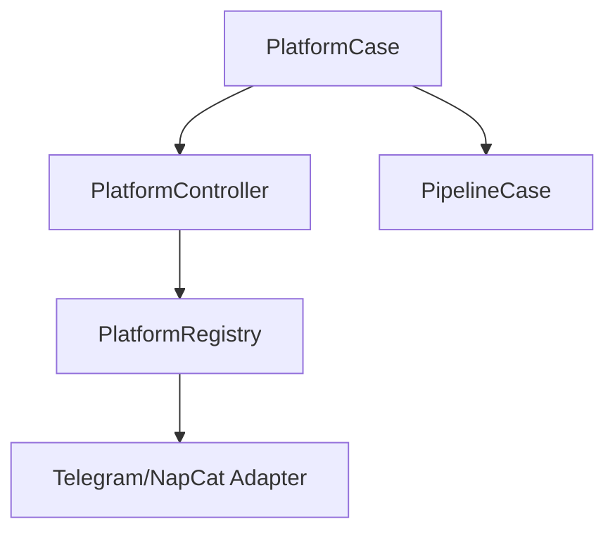
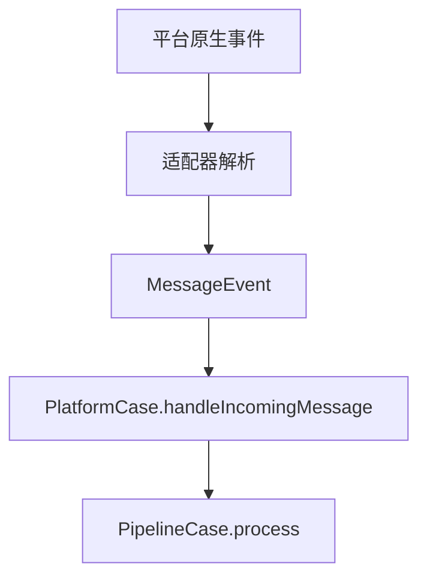

# Platform 模块

日期：2026-06-26

## 代码结构

- `Platform.kt`
- `Platforms.kt`
- `PlatformRegistry.kt`
- `PlatformController.kt`
- `PlatformCase.kt`
- `adapters/telegram/*`
- `adapters/napcat4_18_6/*`

## 暴露的 Case

- `PlatformCase.handleIncomingMessage(...)`

## 业务职责

Platform 模块负责把不同 IM 平台的事件统一成 `MessageEvent`，再把消息送入 pipeline，反向也负责发送回复。

## 结构图

## 流程图

