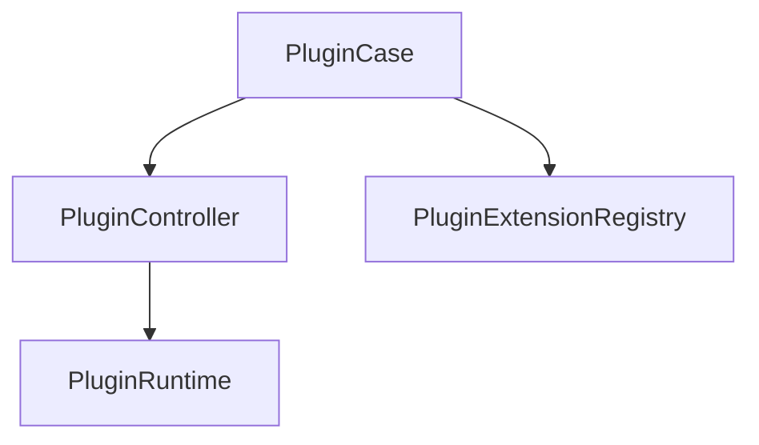
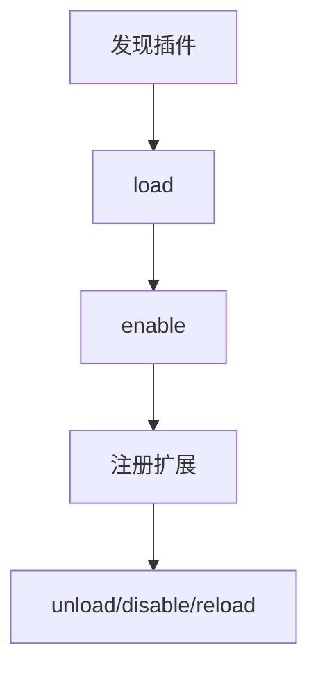

# Plugin 模块

日期：2026-06-26

## 代码结构

- `Plugin.kt`
- `PluginModels.kt`
- `PluginRuntime.kt`
- `PluginExtensionRegistry.kt`
- `PluginController.kt`
- `PluginCase.kt`

## 暴露的 Case

- `PluginCase.list()`
- `PluginCase.discover()`
- `PluginCase.load(...)`
- `PluginCase.enable(...)`
- `PluginCase.disable(...)`
- `PluginCase.unload(...)`
- `PluginCase.reload()`
- `PluginCase.extensions(...)`
- `PluginCase.stop()`

## 业务职责

Plugin 模块负责插件发现、生命周期、启停和扩展注册，是平台、provider、tool 等扩展能力的统一载体。

## 结构图

## 流程图

