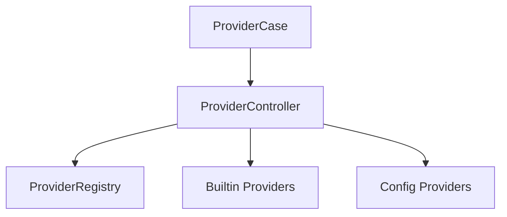
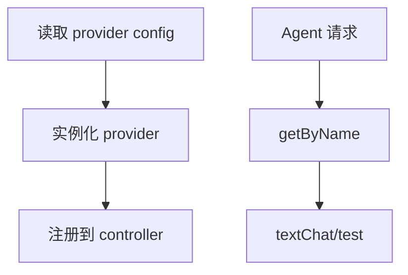

# Provider 模块

日期：2026-06-26

## 代码结构

- `Provider.kt`
- `ProviderController.kt`
- `ProviderCase.kt`
- `BuiltinProviders.kt`
- `model/*.kt`
- `adapters/openai/*`
- `adapters/anthropic/*`
- `adapters/ollama/*`
- `adapters/gemini/*`

## 暴露的 Case

- `ProviderCase.getByName(...)`
- `ProviderCase.getAll()`
- `ProviderCase.getMetaList()`
- `ProviderCase.testAll()`

## 业务职责

Provider 模块抽象 LLM 服务接入层，负责配置化加载、运行时注册和健康检测。

## 结构图

## 流程图

