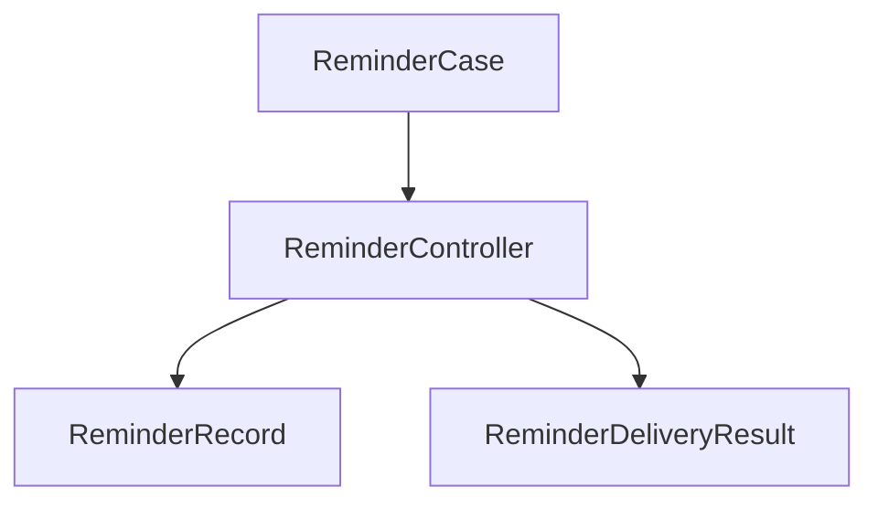
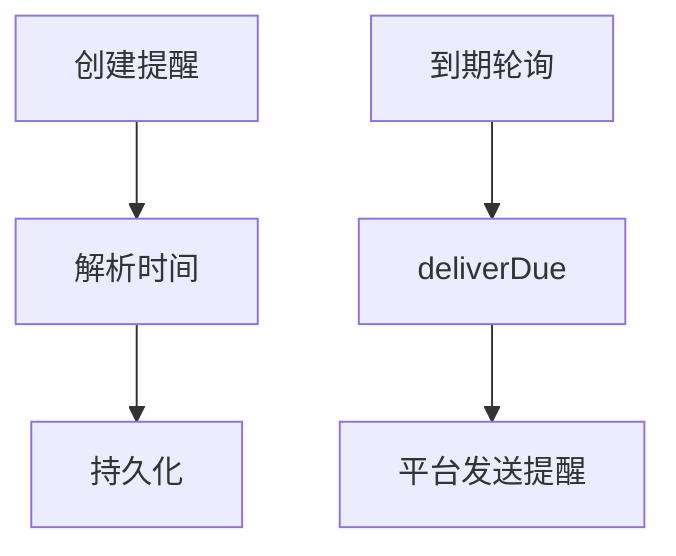

# Reminder 模块

日期：2026-06-26

## 代码结构

- `ReminderModels.kt`
- `ReminderTimeParser.kt`
- `ReminderController.kt`
- `ReminderCase.kt`

## 暴露的 Case

- `ReminderCase.create(...)`
- `ReminderCase.list(...)`
- `ReminderCase.delete(...)`
- `ReminderCase.deliverDue(...)`

## 业务职责

Reminder 模块管理到期提醒的创建、查询、删除和投递。

## 结构图

## 流程图

