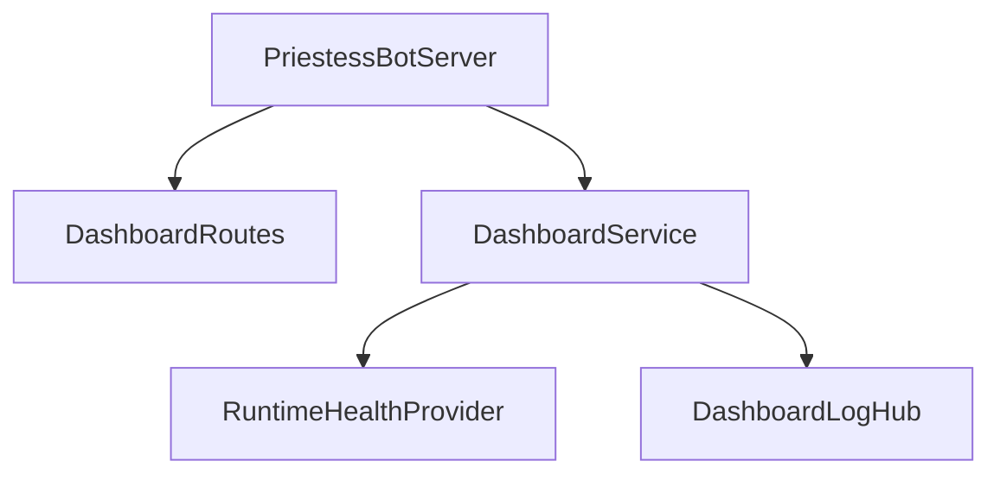
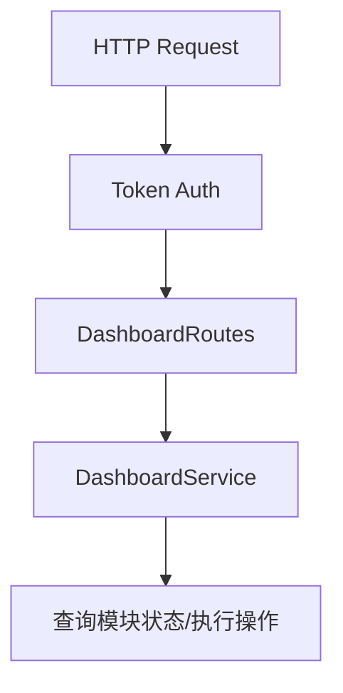

# Server 模块

日期：2026-06-26

## 代码结构

- `PriestessBotServer.kt`
- `DashboardService.kt`
- `DashboardRoutes.kt`
- `ServerDtos.kt`
- `RuntimeHealthProvider.kt`
- `DashboardLogHub.kt`
- `DashboardLogbackAppender.kt`

## 暴露的 Case

- 当前没有独立 `Case` 门面；通过 `DashboardService` 和 `PriestessBotServer` 对外暴露 HTTP 入口。

## 业务职责

Server 模块负责 Dashboard API、WebSocket 日志、健康检查、认证和 Ktor 服务生命周期。

## 结构图

## 流程图

