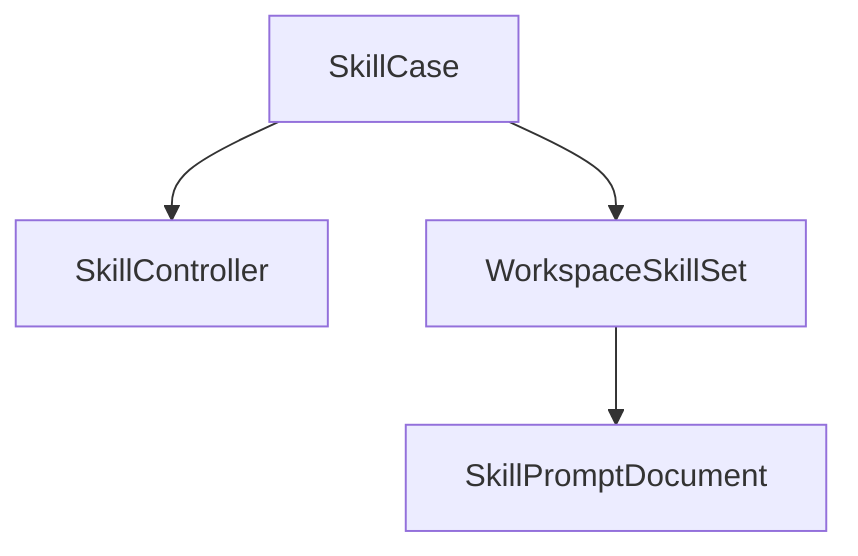
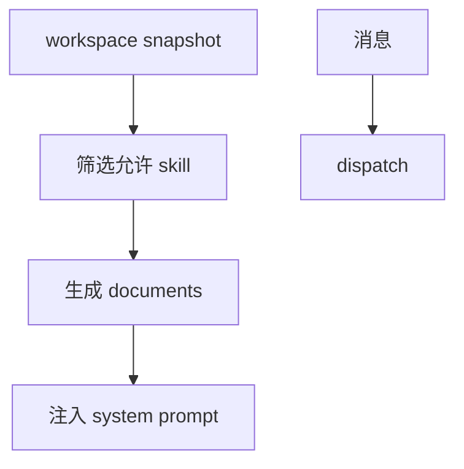

# Skill 模块

日期：2026-06-26

## 代码结构

- `Skill.kt`
- `DefaultSkill.kt`
- `SkillController.kt`
- `SkillCase.kt`
- `PipelineSkillState.kt`

## 暴露的 Case

- `SkillCase.dispatch(...)`
- `SkillCase.register(...)`
- `SkillCase.getAll()`
- `SkillCase.getWorkspaceSkillState(...)`
- `SkillCase.getWorkspaceSkillDocuments(...)`
- `SkillCase.getWorkspaceSkillSet(...)`

## 业务职责

Skill 模块负责轻量技能的注册、优先级排序、消息派发，以及按 workspace 生成可注入的 prompt 文档。

## 结构图

## 流程图

