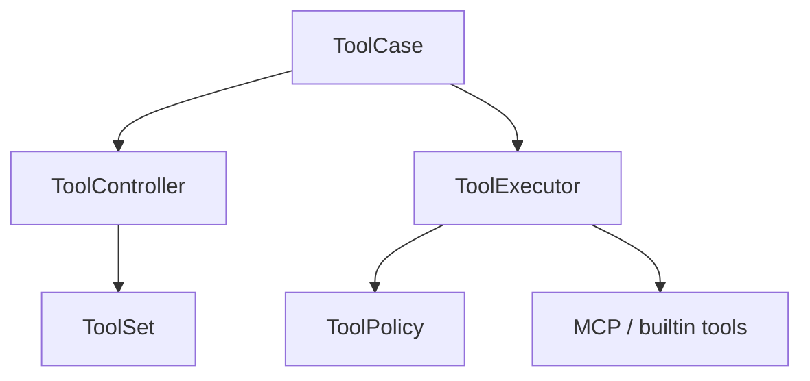
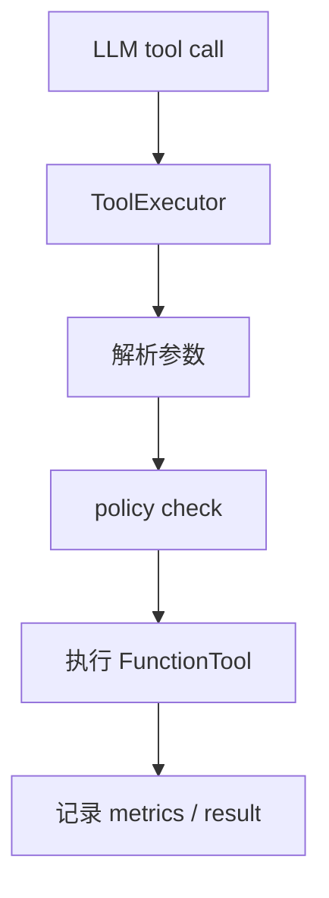

# Tool 模块

日期：2026-06-26

## 代码结构

- `Tool.kt`
- `ToolSet.kt`
- `ToolSchema.kt`
- `ToolResult.kt`
- `ToolPolicy.kt`
- `ToolMetadata.kt`
- `ToolListing.kt`
- `ToolExecutor.kt`
- `ToolController.kt`
- `ToolCase.kt`
- `FunctionTool.kt`
- `AgentToolContext.kt`
- `mcp/*`
- `builtin/*`
- `annotation/Tool.kt`

## 暴露的 Case

- `ToolCase.get(...)`
- `ToolCase.getAll()`
- `ToolCase.toOpenAIFormat()`

## 业务职责

Tool 模块负责 function tool 的注册、过滤、审计、执行、超时控制，以及 MCP 工具桥接。

## 结构图

## 流程图

