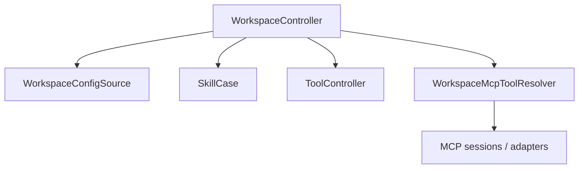
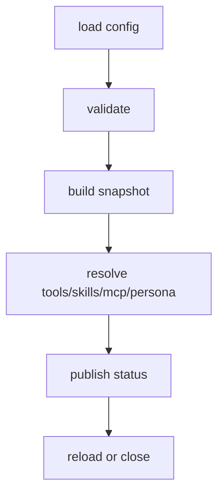

# Workspace 模块

日期：2026-06-26

## 代码结构

- `WorkspaceModels.kt`
- `WorkspaceConfigSource.kt`
- `WorkspaceController.kt`
- `WorkspaceMcpClientSession.kt`
- `WorkspaceMcpToolAdapter.kt`
- `RealWorkspaceMcpClientSession.kt`
- `RealWorkspaceMcpToolResolver.kt`

## 暴露的 Case

- 当前没有单独 `Case` 门面，主要通过 `WorkspaceController` 提供能力。

## 业务职责

Workspace 模块负责 workspace 配置解析、快照构建、资源裁剪、技能/工具/MCP 作用域计算和 reload 生命周期。

## 结构图

## 流程图

