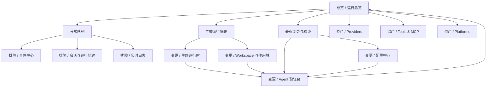

# Dashboard UX Interaction Draft

整理时间：2026-07-08

## 目标

本稿用于定义 `astrbot.kt` 新一代 `dash` 的 UX 交互方向。

本轮只处理 UX，不处理视觉风格定稿，不复用旧 dashboard 的页面结构。目标是把当前“功能页集合”改造成“agent 运维控制台”，让用户能够围绕以下闭环工作：

`看运行态 -> 发现异常 -> 定位原因 -> 修改配置 -> 验证恢复`

对应的低保真页面线框见：

- [dashboard-ux-wireframes.md](/Users/heyanle/Desktop/project/astrbot.kt/docs/2026-07-08/dashboard-ux-wireframes.md)
- [dashboard-ux-live-validation.md](/Users/heyanle/Desktop/project/astrbot.kt/docs/2026-07-08/dashboard-ux-live-validation.md)

## 参考边界

本轮先遇到本机默认 `Python 3.9` 无法直接启动 `hermes-agent` 的问题，但后续已通过临时 `Python 3.12` 虚拟环境、补装 `web/pty` 依赖和本地构建前端，成功在 `localhost:9120` 跑起了 live dashboard。

因此，本稿对 `hermes-agent` 的参考依据最终为：

- `website/docs/user-guide/features/web-dashboard.md`
- `website/static/img/dashboard/*.png`
- `web/` 与 `apps/desktop/` 的源码结构、路由与状态设计
- live dashboard 运行验证记录，见 [dashboard-ux-live-validation.md](/Users/heyanle/Desktop/project/astrbot.kt/docs/2026-07-08/dashboard-ux-live-validation.md)

## 设计结论

### 产品定位

新 `dash` 应定位为：

- 面向机器人/agent 运维者的运行控制台
- 面向配置维护者的生效配置与验证台
- 面向扩展维护者的资产与能力检查面板

不应定位为：

- 纯配置表单后台
- 普通聊天用户的消息界面
- 旧 dashboard 页面的一次重排

### 对 Hermes Agent 的借鉴结论

参考 `hermes-agent` 后，保留以下 UX 思路：

- 首页必须是工作台，而不是欢迎页
- 会话、异常、运行状态要构成主路径，而不是挂在深层二级页
- 全局上下文应稳定存在，例如当前 workspace、当前作用域、当前运行状态
- 配置修改后必须立即有“验证入口”，不能只停在保存成功
- 次级能力应作为支线页面或覆盖层存在，不与主工作流争首页

明确不照搬以下设计：

- 不照搬 Hermes 的 `project -> worktree -> session` 心智模型
- 不照搬嵌入式 TUI 聊天形态
- 不照搬过长的一层导航清单
- 不照搬复杂多层 overlay 结构

## 目标用户

### 1. 值班运维者

最关心：

- 系统现在是否健康
- 当前故障影响范围
- 哪个对象出错
- 如何快速止血

### 2. 配置维护者

最关心：

- 当前实际生效的是哪套配置
- 某次修改是否真正生效
- 生效失败时保留了什么旧状态

### 3. 扩展维护者

最关心：

- provider、tool、plugin、workspace、persona、memory 是否按预期接入
- 能力是否被正确暴露和调用

## UX 原则

### 1. 结果优先，不以配置源为入口

用户首先关心“当前系统实际在怎么运行”，其次才是“这套结果由哪些配置层拼出来”。

### 2. 首页只承载一线任务

一级导航只保留高频动作，低频但复杂的能力降级为二级页或高级页。

### 3. 任何异常都必须带去下一步动作

异常不是纯文本提示，必须附带：

- 查看关联会话
- 查看关联日志
- 查看当前生效配置
- 重试/刷新/重新加载

### 4. 任何配置修改都必须有验证闭环

配置页必须自然连接到：

- 测试消息
- 最近事件
- 日志结果
- 运行总览

### 5. 全局上下文始终稳定

用户在任意页面都应清楚知道：

- 当前系统是否在线
- 当前 workspace / 生效作用域
- 当前数据是否新鲜
- 最近一次变更或刷新是否成功

## 核心对象模型

新 `dash` 的信息架构应围绕以下对象组织，而不是围绕旧页面名称组织：

- Runtime：当前运行状态、健康度、诊断、刷新时间
- Event：异常、告警、失败、重载结果、重要变更
- Conversation Run：会话、消息、tool 事件、验证结果
- Effective Runtime：实际生效配置、来源追踪、作用域
- Capability Asset：platform、provider、tool、plugin、workspace、persona、knowledge

## 一级信息架构

建议一级导航收敛为四组。

### 1. 总览

定位：默认首页，值班与巡检入口。

包含页面：

- 运行总览

### 2. 排障

定位：从症状进入，逐步追到根因。

包含页面：

- 事件中心
- 会话与运行轨迹
- 实时日志
- 运行诊断

### 3. 变更

定位：修改运行行为，并立即验证。

包含页面：

- 生效运行时
- Workspace 与作用域
- Agent 验证台
- 配置中心（高级）

### 4. 资产

定位：查看与管理系统能力清单。

包含页面：

- Providers
- Tools & MCP
- Platforms
- Plugins
- Persona & Memory
- Knowledge

## 首页工作台

首页不再是概念介绍页，而是单屏可操作工作台。

### 结构

#### A. 全局状态条

固定在页面顶部，始终可见。

显示：

- Overall health
- WebSocket / log stream 状态
- 当前 workspace
- 当前数据更新时间
- 主刷新按钮
- 最近一次 reload / apply 结果

#### B. 健康摘要区

4 到 6 张摘要卡，优先表达：

- 总体健康状态
- 过去 30 分钟错误/告警数
- 活跃会话数
- 运行中的平台数
- 可用 provider 数
- 最近一次配置变更状态

每张卡都必须能点击进入下一步页面。

#### C. 异常队列

首页核心模块。

按时间倒序显示最近异常、失败或降级状态。

每条异常至少包含：

- 类型
- 严重程度
- 关联对象
- 发生时间
- 推荐下一步动作

支持一键进入：

- 会话详情
- 日志定位
- 生效配置
- 重试操作

#### D. 当前生效运行面板

用于回答“系统当前到底跑的是哪套配置”。

显示：

- 当前 workspace
- 当前主 agent
- 当前 provider / model
- 当前 tool policy
- 关键配置覆盖来源

这里不展示大段 JSON，只展示结果摘要和“查看来源链”入口。

#### E. 最近变更与验证

用于承接“刚改过什么”和“现在是否恢复”。

显示：

- 最近 reload/保存/启停结果
- 最近一次 Agent test 的状态
- 最近一次失败验证

提供 CTA：

- 重新验证
- 查看变更影响
- 返回总览确认

#### F. 快速会话入口

展示最近活跃会话或最近失败会话。

作用不是聊天，而是用于排障和验证跳转。

## 页面层级草图

## 关键主路径

### 1. 巡检路径

1. 打开 `dash`
2. 进入 `总览`
3. 扫描健康摘要与异常队列
4. 若无异常，结束
5. 若有异常，点击异常进入 `事件中心` 或 `会话/日志`

### 2. 异常排查路径

1. 从首页异常队列进入某条事件
2. 查看事件详情中的关联对象
3. 进入关联会话或运行轨迹
4. 查看 tool 事件、注入轨迹、失败节点
5. 必要时跳转日志页查看原始证据
6. 再跳转到生效运行时或配置对象页确认根因

推荐跳转链：

`事件 -> 会话/运行轨迹 -> 日志 -> 生效运行时 -> 具体配置对象`

### 3. 配置修改路径

1. 从 `生效运行时` 或 `资产页` 进入目标对象
2. 打开编辑态
3. 展示变更摘要与影响范围
4. 执行保存 / reload / 启停
5. 返回 `Agent 验证台`
6. 运行一次测试消息或测试调用
7. 再返回 `总览` 看是否恢复健康

推荐跳转链：

`配置对象 -> 应用变更 -> Agent 验证台 -> 日志/总览`

### 4. 资产检查路径

1. 从 `资产` 进入对象列表
2. 通过筛选和状态标签查看对象清单
3. 在右侧详情查看启用状态、来源、作用域、最近异常
4. 需要改动时跳到 `变更`
5. 需要排障时跳到 `排障`

## 交互模式规范

### 列表 + 详情

大部分资产页和排障页采用：

- 左侧列表 / 表格
- 右侧详情

避免每次点击都跳整页，提升扫描和对比效率。

### 异常与对象双向跳转

必须保证：

- 异常可跳到对象
- 对象可跳到最近异常

### 保存前预览

涉及运行行为的配置变更，不直接静默保存。

至少提供：

- 变更摘要
- 影响对象
- 是否立即生效
- 生效失败后的保留策略

### 验证结果结构化展示

`Agent 验证台` 不只显示最终回复，还应显示：

- 选中的 provider / model
- 使用的 workspace
- 调用过的 tools
- 关键 execution events
- injection trace
- 总耗时

### 数据新鲜度

所有动态面板都要显式表达数据是否新鲜：

- live
- delayed
- disconnected
- stale

不能只在后台静默轮询。

## 关键状态规范

建议统一五级状态：

- `healthy`
- `degraded`
- `failing`
- `reloading`
- `unknown`

并补充统一页面态：

- loading
- empty
- error
- no permission
- disconnected

每种状态都要带文字，不依赖颜色单独表达。

## 旧页面迁移原则

### 升级为主路径

应进入一级主工作流的旧能力：

- Overview
- Conversations
- Logs
- Effective Runtime
- Working Directory / Workspace
- Agent

### 下沉为二级页

保留但不占首页权重：

- Providers
- Tools
- Platforms
- Plugins
- Persona & Memory
- Knowledge
- Sub-Agents

### 进入高级模式

低频高风险，不应强曝光：

- 原始配置 JSON 编辑
- 数据库层配置写回
- 配置备份恢复

## V1 范围建议

### V1 必做

- 新一级信息架构
- 新首页工作台
- 事件/会话/日志/生效配置/验证闭环
- 资产页与主路径互跳
- 明确状态系统与空态/错误态

### V1 不做

- 聊天式 embedded terminal
- 复杂 overlay 体系
- 仓库/project/worktree 结构化外壳
- 大而全分析报表中心

## 实施建议

进入下一轮 UI 设计前，建议先以本稿为准补一版低保真线框，重点只画以下 5 个界面：

- 首页运行总览
- 事件中心
- 会话与运行轨迹
- 生效运行时
- Agent 验证台

这 5 个界面画清楚后，整套 `dash` 的 UX 主骨架就稳定了，后续资产页只需套入同一交互语言。
