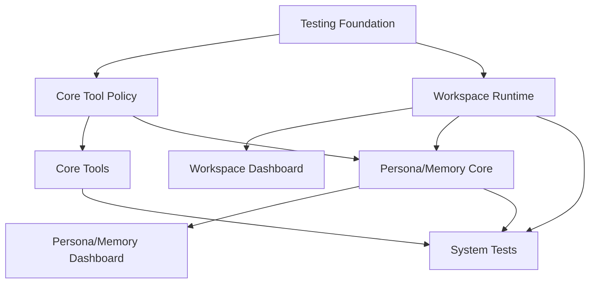

# execution-plan — v3 执行计划

本计划由架构负责人整合测试、Agent/Tool、Runtime/Workspace、Persona/Memory 四个方向，目标是让 v3 可以按任务推进，而不是停留在概念层。

## 设计原则

- 先测试后扩展：先给现有核心链路补测试，再做高风险结构变更。
- 默认能力安全：核心 tool 只默认开启低风险能力，高风险能力必须显式配置。
- 工作区快照化：运行中的消息使用进入 pipeline 时的 workspace snapshot，不被 reload 影响。
- 人格记忆可解释：任何 prompt 注入都能在调试/API 中看到来源。
- 向后兼容：没有 workspace 配置时，自动使用 `default` workspace 映射当前全局配置。

## 阶段 1：质量底座

目标：建立可回归的核心测试网。

交付物：

- `ReActRunnerTest`
- `ToolExecutorTest`
- Pipeline stage tests
- Fake platform/provider/tool fixtures
- `MessageFlowSystemTest`

验收：

- `./gradlew test` 通过。
- 至少覆盖一条 ReAct tool call 系统链路。

## 阶段 2：核心 Tool

目标：补齐无插件场景的核心 Agent 行动能力。

交付物：

- `ToolPermission` / `ToolPolicy`
- `list_tools`
- `health_check`
- `fetch_url`
- `conversation_search`
- `memory_save`
- `memory_recall`
- `memory_delete`
- `create_reminder`
- `list_reminders`
- `delete_reminder`

验收：

- 所有新增 tool 有 schema。
- 所有新增 tool 有单元测试。
- ToolExecutor 支持 timeout 和权限拒绝。
- Dashboard ToolView 可展示风险等级和启用状态。

## 阶段 3：Workspace

目标：建立 workspace 运行时作用域和热重载能力。

交付物：

- `WorkspaceConfig`
- `WorkspaceSnapshot`
- `WorkspaceController`
- workspace resolve 接入 pipeline。
- workspace scoped tools/skills/MCP/persona/memory。
- Dashboard Workspace API/Page。

验收：

- reload 成功后新消息使用新 snapshot。
- reload 失败时旧 snapshot 继续可用。
- 正在处理的消息不受 reload 中途影响。
- skill/MCP 配置变更可被 reload 发现。

## 阶段 4：Persona/Memory

目标：让 Agent 拥有可管理的人格和长期记忆。

交付物：

- `Persona`
- `MemoryRecord`
- `PersonaController`
- `MemoryController`
- `MemoryRetriever`
- `PersonaMemoryInjector`
- Dashboard Persona/Memory API/Page。

验收：

- 可创建/修改/删除 persona。
- 可保存/检索/删除/过期 memory。
- Agent chat test 能展示注入 persona 和 memory id。
- memory scope 不跨 workspace/session/user 泄露。

## 阶段 5：系统验收与文档

目标：v3 能被稳定交付和继续维护。

交付物：

- 系统测试覆盖标准聊天链路、tool 链路、workspace reload、persona/memory 注入。
- docs 更新模块现状。
- roadmap v3 完成状态更新。
- OpenSpec change 拆分归档。

验收：

- `./gradlew test` 通过。
- `openspec validate --specs` 通过。
- Dashboard 手动验收路径清晰。

## OpenSpec change 拆分

当前已按以下 change 拆分并完成实现：

- `v3-testing-foundation`
- `v3-core-tools`
- `v3-workspace-runtime`
- `v3-persona-memory-core`

## 当前推进状态

截至 2026-06-25，v3 首批 4 个 OpenSpec changes 均已完成 tasks 并通过 strict validation：

| Change | 角色 | 状态 | 说明 |
|--------|------|------|------|
| `v3-testing-foundation` | 测试负责人 | Complete | 已建立测试分层、fixtures、Agent/Tool/Pipeline/Dashboard/System 测试门禁 |
| `v3-core-tools` | Agent/Tool 负责人 | Complete | 已实现 Tool policy、核心工具、timeout、Dashboard ToolView 状态 |
| `v3-workspace-runtime` | Runtime/Workspace 负责人 | Complete | 已实现 workspace config/snapshot/reload/rollback/scoped resources、skill/MCP lifecycle |
| `v3-persona-memory-core` | Persona/Memory 负责人 | Complete | 已实现 persona、memory、retriever、injector、memory tools、Dashboard API/前端 |

实施顺序已按 testing foundation -> core tools -> workspace runtime -> persona/memory core 完成；系统验收由默认 `./gradlew test`、Dashboard smoke scripts、frontend build 和 OpenSpec strict validation 承担。

## 跨模块依赖

## 风险与缓解

- Tool 权限模型过重：先实现最小 `riskLevel + enabled`，再扩展 confirmation/audit。
- Workspace 影响现有全局配置：提供 default workspace 兼容层。
- Memory 注入污染 prompt：限制注入数量和字符数，提供可解释日志。
- System test flaky：使用 fake provider/platform/tool，不依赖网络。
- MCP reload 资源泄漏：reload plan 必须定义旧连接关闭时机和失败回滚。
